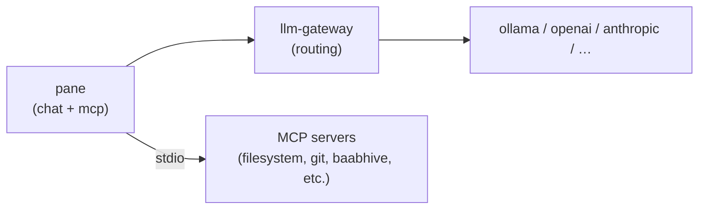
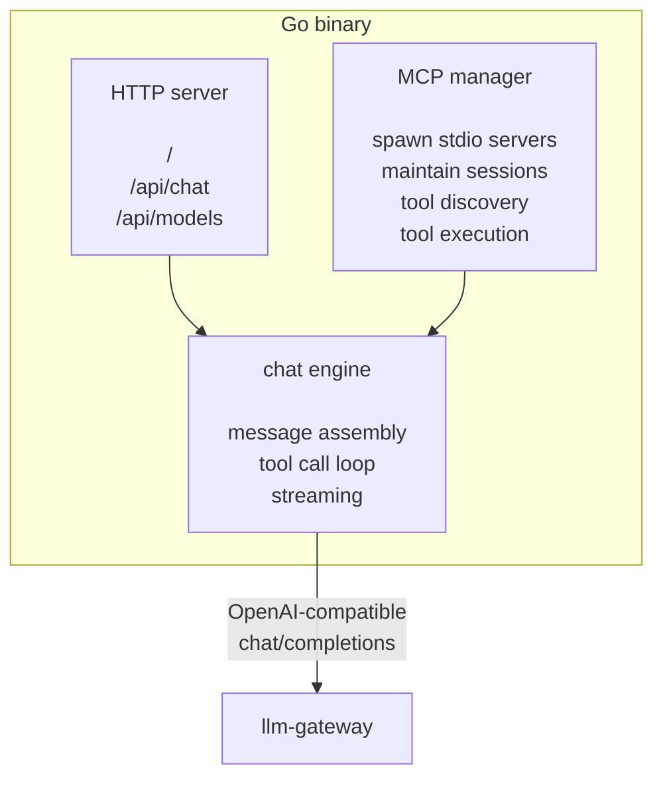

# pane — design document

a thin pane of glass between a human and an LLM. Go binary with an embedded web frontend. first-class MCP stdio support.

## problem

open-webui and its ilk are bloated. they bundle auth, RAG, model management, user management, plugin systems — machinery that belongs elsewhere in the stack. worse, their MCP support is HTTP-only, which means every local MCP server needs a transport adapter just to be reachable.

what's needed is a thin pane of glass between a human and an OpenAI-compatible completions endpoint (llm-gateway), with the ability to wire in MCP stdio servers directly — the same way Claude Desktop does it, but without the Anthropic lock-in.

## positioning

pane sits at the terminal edge of the llm-gateway / mcp-gateway ecosystem:



llm-gateway handles model routing, auth, and backend selection. mcp-gateway handles multi-tenant tool aggregation over zero-trust networking. pane handles the human conversation — it doesn't need to know about any of that plumbing. it just talks OpenAI-compatible chat completions and spawns local MCP servers.

## principles

- **single binary.** build it, run it, open a browser. no node, no docker, no database.
- **embedded frontend.** the web UI is `embed.FS` inside the binary. one artifact to distribute.
- **config, not code.** MCP servers, endpoint URL, model selection — all in a YAML file.
- **stdio MCP only.** pane runs on the same machine as the human. it spawns MCP servers as child processes and talks stdio. HTTP/SSE MCP belongs in mcp-gateway.
- **stateless by default.** conversations live in the browser (localStorage). the backend is a proxy with MCP superpowers. persistence is a future concern, not a launch concern.
- **streaming everywhere.** SSE from backend to frontend. streaming from llm-gateway to backend.

## architecture

### components



### chat engine — the tool call loop

the core of the backend is a standard OpenAI tool-calling loop (`internal/llm/toolloop.go`):

```
1. receive user message from frontend (POST /api/chat)
2. assemble messages array (system prompt + conversation history + user message)
3. attach tool definitions (discovered from MCP servers, translated to OpenAI function format)
4. POST to llm-gateway /v1/chat/completions (stream=true)
5. if response contains tool_calls:
     a. for each tool_call, route to the appropriate MCP server
     b. execute via MCP stdio (concurrently when the model emits multiple calls)
     c. append tool results to messages
     d. goto 4
6. stream final assistant response back to frontend via SSE
```

two guards bound the loop. a hard iteration cap (`max_iterations` error if exceeded) prevents runaway loops, and a repeated-failure tracker watches for the same tool call failing again and again — after the threshold, the loop forces a final response by telling the model that tool calls are disabled and it must answer with what it has (`repeated_tool_failure` if the model persists anyway).

the frontend sends the full conversation history with each request. the backend is stateless — it just proxies, executes tools, and streams back. this means the backend never stores messages, and the browser owns the conversation.

### MCP manager

at startup, the MCP manager (`internal/mcp/manager.go`) reads the config and spawns each configured MCP server as a child process. it holds the stdio pipes and MCP client sessions.

responsibilities:
- **lifecycle:** spawn on startup, monitor stderr, graceful shutdown. a server that fails to spawn is marked `error` and its tools are simply absent; there is no automatic restart of crashed servers.
- **discovery:** call `tools/list` on each server, cache the tool manifests.
- **namespacing:** generate a model-safe callable name for each tool (see translation below) and maintain a routing table from callable name back to (server, tool).
- **translation:** convert MCP tool schemas to OpenAI function-calling format (JSON Schema is the common substrate, so this is mostly structural mapping).
- **execution:** route `tool_calls` from the LLM response to the correct MCP server, call `tools/call` with a per-server timeout (default 30s), return results.

### HTTP API

minimal surface:

| endpoint | method | description |
|---|---|---|
| `/` | GET | serve embedded frontend |
| `/api/health` | GET | health check, returns `{"status": "ok"}` |
| `/api/config` | GET | server defaults for the UI: `default_model`, `default_system`, `mcp_separator` |
| `/api/chat` | POST | chat completion proxy with MCP tool loop. accepts OpenAI-format messages array. returns SSE stream. |
| `/api/models` | GET | proxy to llm-gateway's `/v1/models` |
| `/api/tools` | GET | return discovered MCP tools and server statuses (for frontend display) |
| `/api/tools/approve` | POST | approve or deny a pending tool call (for servers with `approve: true`) |

### API schemas

#### `POST /api/chat`

request body — the frontend sends the full conversation history every time. the backend is stateless.

```json
{
  "model": "qwen2.5:14b",
  "messages": [
    { "role": "user", "content": "Show me groove tag distribution for 90-110 bpm" },
    { "role": "assistant", "content": null, "tool_calls": [
      { "id": "tc_1", "type": "function", "function": { "name": "baabhive_hive_sql_3f9c2ab1d4", "arguments": "{\"sql\": \"SELECT ...\"}" } }
    ]},
    { "role": "tool", "tool_call_id": "tc_1", "content": "[{\"tag\": \"straight-pocket\", \"count\": 842}, ...]" },
    { "role": "assistant", "content": "Here's the distribution..." },
    { "role": "user", "content": "Now filter to only shuffle patterns" }
  ],
  "system_prompt_mode": "default",
  "system_prompt": ""
}
```

the `messages` array uses standard OpenAI chat format, including any tool call/result pairs from prior turns. the system prompt is resolved server-side from `system_prompt_mode`: `default` uses the configured system prompt, `custom` uses the request's `system_prompt`, and `none` sends no system message at all.

response — SSE stream. `Content-Type: text/event-stream`.

#### `GET /api/models`

passthrough proxy to llm-gateway's `GET /v1/models`. response is the standard OpenAI models list:

```json
{
  "object": "list",
  "data": [
    { "id": "qwen2.5:14b", "object": "model", "owned_by": "ollama" },
    { "id": "llama3.1:8b", "object": "model", "owned_by": "ollama" }
  ]
}
```

#### `GET /api/tools`

returns the discovered MCP tools — each with its source server, original name, and the callable function form sent to the LLM — plus per-server status:

```json
{
  "tools": [
    {
      "server": "baabhive",
      "name": "hive_sql",
      "function": {
        "name": "baabhive_hive_sql_3f9c2ab1d4",
        "description": "Execute a SQL query against the hive database",
        "parameters": {
          "type": "object",
          "properties": {
            "sql": { "type": "string", "description": "SQL query to execute" }
          },
          "required": ["sql"]
        }
      }
    }
  ],
  "servers": {
    "baabhive": { "status": "running", "tools_count": 4 },
    "filesystem": { "status": "running", "tools_count": 6 },
    "git": { "status": "error", "tools_count": 0, "error": "spawn failed: uvx not found" }
  }
}
```

server statuses are `starting`, `running`, or `error`.

### SSE streaming protocol

this is the critical contract between backend and frontend. the backend emits a sequence of typed SSE events that let the frontend render the full tool-call loop in real time. event data types live in `internal/sse/writer.go`; the consuming state machine is `ui/src/hooks/useChat.ts`.

#### event types

```
event: delta
data: {"content": "Here's the"}

event: tool_call_start
data: {"index": 0, "id": "tc_1", "name": "baabhive_hive_sql_3f9c2ab1d4"}

event: tool_call_args
data: {"index": 0, "id": "tc_1", "arguments_partial": "{\"sql\": \"SELECT tag, COUNT(*) ..."}

event: tool_call_executing
data: {"index": 0, "id": "tc_1", "name": "baabhive_hive_sql_3f9c2ab1d4"}

event: tool_call_result
data: {"index": 0, "id": "tc_1", "name": "baabhive_hive_sql_3f9c2ab1d4", "status": "complete", "content": "[{\"tag\": \"straight-pocket\", ...}]", "duration_ms": 12}

event: round_complete
data: {"assistant": {"role": "assistant", "content": null, "tool_calls": [...]}, "tool_messages": [{"role": "tool", "tool_call_id": "tc_1", "content": "..."}]}

event: delta
data: {"content": "The corpus leans heavily toward straight-pocket grooves..."}

event: done
data: {}
```

`round_complete` fires after each tool round, carrying the assistant message (with its tool calls) and the tool result messages — the frontend appends these to the conversation so the history it sends next turn matches what the model actually saw.

for servers with `approve: true`, an approval gate is inserted before `tool_call_executing`:

```
event: tool_call_approve
data: {"index": 0, "id": "tc_1", "name": "filesystem_write_file_8a1c44b09e", "arguments": "{\"path\": \"...\", \"content\": \"...\"}"}
```

the frontend renders an approve/deny prompt inline in the tool block. the user's decision is sent via:

```
POST /api/tools/approve
{ "id": "tc_1", "approved": true }
```

the backend holds the SSE stream open waiting on this, with a 5-minute timeout. on approval, it proceeds to `tool_call_executing`. on denial, it injects a denial as the tool result and lets the LLM continue. on timeout, the tool call fails with `approval_timeout`.

tool-level failures are not stream errors — they arrive as `tool_call_result` with `status: "error"` and an `error_code`:

| error_code | meaning |
|---|---|
| `denied` | user denied the approval prompt |
| `approval_timeout` | no approval decision within 5 minutes |
| `cancelled` | request context cancelled mid-execution |
| `malformed_arguments` | LLM produced arguments that don't parse as JSON |
| `execution_error` | the MCP server returned an error or the call timed out |

the failure is injected into the messages as a `role: tool` result, and the model decides how to respond — it often recovers gracefully ("I wasn't able to run that query, but here's what I can tell you...").

stream-level errors use `event: error` and do close the stream:

```
event: error
data: {"code": "upstream_unreachable", "message": "connection refused"}
```

| code | meaning |
|---|---|
| `upstream_unreachable` | can't connect to llm-gateway |
| `upstream_error` | llm-gateway returned an HTTP error or the stream broke mid-response |
| `repeated_tool_failure` | the model kept calling tools after the loop forced a final answer |
| `max_iterations` | tool call loop exceeded the iteration cap |

#### event lifecycle for a single turn

```
1. user sends POST /api/chat
2. backend opens SSE stream
3. backend submits to llm-gateway with stream=true

4. llm-gateway streams tokens:
   → backend emits `event: delta` for each content chunk

5. llm-gateway emits a tool_call:
   → backend emits `event: tool_call_start` (frontend renders the tool block header)
   → backend emits `event: tool_call_args` as argument tokens arrive (frontend shows arguments building)

6. tool_call is complete:
   → if server has `approve: true`:
     → backend emits `event: tool_call_approve` (frontend shows approve/deny buttons)
     → backend waits on POST /api/tools/approve (5-minute timeout)
     → if denied or timed out: inject failure as tool result, goto 7
   → backend emits `event: tool_call_executing` (frontend shows executing state)
   → backend dispatches to MCP manager → MCP server via stdio
   → MCP server returns result
   → backend emits `event: tool_call_result` (frontend shows result, collapses block)

7. all tool calls in the round resolved:
   → backend emits `event: round_complete` with the assistant and tool messages
   → backend re-submits to llm-gateway with tool results appended to messages
   → goto 4 (may produce more tool calls or final content)

8. llm-gateway signals completion:
   → backend emits `event: done`
   → SSE stream closes
```

#### multiple tool calls in one turn

some models emit multiple tool calls in parallel. the backend handles this by:
- emitting `tool_call_start` for each call as they arrive in the stream
- executing all tool calls concurrently (goroutines)
- emitting `tool_call_result` for each as they complete (order may differ from call order)
- emitting `round_complete` and re-submitting once all are complete

the frontend matches events by `id` to render each tool block independently.

### MCP-to-OpenAI schema translation

MCP `tools/list` returns tools in MCP format. pane translates these to OpenAI function-calling format for the llm-gateway request. the schema mapping is mechanical — `description` and `inputSchema` pass through (both are JSON Schema) — but the function name is generated, not joined:

- the callable name is `sanitize(server_tool)` truncated and suffixed with a 10-character sha256 hash of the (server, tool) identity, capped at 64 characters — the OpenAI function-name limit. e.g. `baabhive` + `hive_sql` → `baabhive_hive_sql_3f9c2ab1d4`.
- sanitization strips characters that models mishandle in function names; the hash suffix guarantees uniqueness even when sanitization or truncation would collide.
- when a tool call comes back from the LLM, the manager resolves the callable name through its routing table — no string splitting — and dispatches `tools/call` to the right server with `function.arguments` passed directly as MCP arguments.

MCP `tools/call` returns `content` as an array of content blocks (text, image, etc.). pane serializes the text blocks as a JSON string for the OpenAI `tool` message role's `content` field.

note: the config exposes `mcp.separator` (surfaced to the UI via `/api/config` as `mcp_separator`), but the callable-name builder currently hardcodes `_` — the knob is wired through but unused.

### frontend

a React/TypeScript SPA built with Vite, embedded in the Go binary via `go:embed`. the build output (`ui/dist/`) is the only thing the Go binary sees — no node runtime at deploy time. same pattern as zrok. `ui/embed_stub.go` (build tag `no_ui`) enables headless builds.

```
ui/
├── embed.go              # //go:embed dist (build tag: !no_ui)
├── embed_stub.go         # empty FS (build tag: no_ui)
├── middleware.go         # SPA middleware: /api/ passthrough, index.html fallback
├── index.html
├── vite.config.ts
└── src/
    ├── main.tsx
    ├── App.tsx               # top-level layout, conversation state (localStorage)
    ├── index.css
    ├── types.ts              # Conversation, Message, ToolCall, SSEEvent, etc.
    ├── lib/
    │   ├── sse.ts            # SSE stream parser (pane's protocol)
    │   └── exportMarkdown.ts # conversation-to-markdown export
    ├── hooks/
    │   ├── useChat.ts        # streaming, tool call state machine, approvals
    │   ├── useConfig.ts      # GET /api/config
    │   ├── useLocalStorage.ts
    │   ├── useModels.ts      # GET /api/models
    │   └── useTools.ts       # GET /api/tools
    └── components/
        ├── ChatView.tsx
        ├── MessageBubble.tsx
        ├── MarkdownCodeBlock.tsx
        ├── ToolCallBlock.tsx
        ├── ModelSelector.tsx
        ├── ToolPanel.tsx
        ├── ConversationList.tsx
        └── SystemPromptEditor.tsx
```

#### frontend types

the shapes the frontend works with (`ui/src/types.ts`), abbreviated:

```typescript
interface Conversation {
  id: string;              // nanoid
  title: string;           // first user message, truncated to 50 chars
  messages: Message[];
  createdAt: number;
  updatedAt: number;
}

interface Message {
  role: 'system' | 'user' | 'assistant' | 'tool';
  content: string | null;
  tool_calls?: ToolCall[];                            // assistant messages with tool invocations
  tool_call_results?: Record<string, ToolCallResult>; // render state for completed tool calls
  tool_call_id?: string;                              // tool result messages
}

type SSEEvent =
  | { type: 'delta'; content: string }
  | { type: 'tool_call_start'; index: number; id: string; name: string }
  | { type: 'tool_call_args'; index: number; id: string; arguments_partial: string }
  | { type: 'tool_call_approve'; index: number; id: string; name: string; arguments: string }
  | { type: 'tool_call_executing'; index: number; id: string; name: string }
  | { type: 'tool_call_result'; index: number; id: string; name: string; status: string; error_code?: string; content: string; duration_ms: number }
  | { type: 'round_complete'; assistant: Message; tool_messages: Message[] }
  | { type: 'error'; code: string; message: string; tool_call_id?: string }
  | { type: 'done' };
```

#### frontend state flow

the `useChat` hook manages the streaming lifecycle. the chat POST returns an SSE body which the hook reads via `fetch` and a hand-rolled parser (`lib/sse.ts`) — EventSource can't POST, so the stream is consumed from the response body directly.

```
1. user presses send
2. append user message to conversation.messages
3. POST /api/chat with full messages array
4. read the SSE response body through the parser
5. for each SSE event:
   - delta              → append to streaming buffer, render with cursor
   - tool_call_start    → create a ToolCallBlock in "loading" state
   - tool_call_args     → update ToolCallBlock with streaming arguments
   - tool_call_approve  → flip ToolCallBlock to "awaiting_approval", show approve/deny buttons
   - tool_call_executing → flip ToolCallBlock to "executing" state
   - tool_call_result   → flip ToolCallBlock to "complete" or "error", show result (collapsible)
   - round_complete     → commit assistant + tool messages to the conversation history
   - error              → show inline error (tool-level) or stream-level error
   - done               → finalize assistant message
6. save conversation to localStorage
```

tool call block states: `loading` → `args_streaming` → [`awaiting_approval` →] `executing` → `complete` | `error`. the approval state only appears for servers with `approve: true`.

the UI:

- **chat view.** messages rendered as markdown (with syntax-highlighted code blocks). streaming token display with a visible cursor/caret.
- **tool call visibility.** when the LLM invokes a tool, show it inline — the tool name, arguments (collapsible), and result (collapsible). not hidden, not modal — part of the conversation flow. think Claude Desktop's tool use blocks.
- **model selector.** dropdown populated from `/api/models`. persisted in localStorage.
- **tool panel.** slide-out sidebar showing discovered MCP tools and server statuses.
- **system prompt.** editable, with default/custom/none modes, persisted in localStorage.
- **conversation management.** new chat, history list (localStorage), delete, markdown export.

no auth. no user management. no settings pages. no plugin system.

### aesthetic direction

pane should feel like a calm, literate workspace — closer to Claude Desktop than to a terminal emulator. the spiritual reference is the quiet confidence of a well-set book page: generous whitespace, measured typography, nothing competing for attention.

**typography.** Source Serif 4 as the primary typeface — for the UI chrome, message text, and anywhere prose appears. it's warm, readable at body sizes, and gives pane a distinctive character that separates it from the monospace-everything crowd. JetBrains Mono for code blocks, tool call arguments, and tool results — the places where alignment matters. both are variable fonts bundled via @fontsource-variable and embedded in the binary, so the UI renders identically offline with no third-party font requests. the contrast between serif prose and mono code creates a natural visual hierarchy.

**color.** light and dark themes, defaulting to system preference. the palette is restrained — warm neutrals (not blue-gray), with a single accent color for interactive elements and the streaming cursor. think claude.ai's warm sand/cream in light mode, soft charcoal in dark mode. avoid cold grays and saturated colors.

**layout.** centered conversation column with comfortable max-width (960px). sidebar for conversations and tools, collapsible. messages should breathe — generous vertical spacing between turns. tool call blocks are visually distinct but not disruptive: slightly inset, muted background, with expand/collapse affordance.

**interaction.** subtle transitions. no bouncing, no sliding panels, no loading spinners beyond a simple pulsing dot for streaming. the interface should feel like it's already there, waiting — not performing.

the overall impression: a tool made by someone who reads books.

## configuration

```yaml
# ~/.config/pane/config.yaml (or ./pane.yaml)

# the OpenAI-compatible endpoint to proxy to
endpoint: http://localhost:18080/v1

# bearer token for LLM endpoint authentication (optional)
#api_key: sk-...

# default model (overridable in UI)
model: qwen2.5:14b

# system prompt (overridable in UI)
system: "You are a helpful assistant."

# listen address
listen: 127.0.0.1:8400

# MCP servers — same conceptual model as Claude Desktop
mcp:
  servers:
    filesystem:
      command: npx
      args:
        - -y
        - "@modelcontextprotocol/server-filesystem"
        - "/home/michael/projects"
      env:
        NODE_ENV: production
      approve: true              # human-in-the-loop: confirm before executing
      timeout: 30s

    baabhive:
      command: /home/michael/bin/baabhive-mcp
      args:
        - --db
        - /home/michael/data/baabhive.db
```

the config cascade, lowest to highest priority: compiled defaults → `~/.config/pane/config.yaml` → `./pane.yaml` → `--config` flag. loading uses `dd.MergeYAMLFile` (`internal/config/config.go`).

## dependencies

### Go
- **`mark3labs/mcp-go`** — Go MCP SDK. handles stdio transport, client sessions, tool discovery and execution.
- **`spf13/cobra`** — CLI structure (`pane`, `pane new`, `pane version`).
- **`michaelquigley/df/dl`** — logging (per project convention).
- **`michaelquigley/df/dd`** — config marshaling (per project convention).
- **hand-rolled LLM client** (`internal/llm`) — OpenAI-compatible chat completions, streaming, function calling. deliberately not a third-party library; see project rules.
- **standard library** — `net/http`, `embed`, `encoding/json`, `os/exec`.

### Frontend
- **React 19** + **TypeScript** — UI framework.
- **Vite** — build tooling. fast dev server, clean production output for embedding.
- **react-markdown** + **remark-gfm** — markdown rendering in messages.
- **react-syntax-highlighter** (prism) — code blocks.
- **@fontsource-variable/source-serif-4** + **@fontsource-variable/jetbrains-mono** — bundled fonts.
- **nanoid** — conversation ids.
- minimal beyond that. no state management library (React context + hooks is sufficient for this scope). no component library — pane's aesthetic is custom.

## error handling

pane has three failure domains, each with a distinct recovery strategy.

### MCP server failures

| failure | backend behavior | frontend rendering |
|---|---|---|
| server fails to spawn | log error, mark server `error` in `/api/tools`, exclude its tools | server shows error status in tool panel |
| tool call returns error | wrap as tool result with `error_code: execution_error`, inject into messages as `role: tool` | tool block shows error state; LLM sees the error and can respond to it |
| tool call times out | per-server timeout (default 30s) cancels the call, same `execution_error` path | same inline rendering |
| same call fails repeatedly | failure tracker forces a final response without tools | conversation continues with the model's best answer |

the key principle: tool errors are not stream errors. when a tool fails, pane injects the failure as a tool result and lets the LLM continue. the SSE stream only closes on unrecoverable errors.

### llm-gateway failures

| failure | backend behavior | frontend rendering |
|---|---|---|
| connection refused | emit `event: error` with `code: upstream_unreachable`, close stream | error shown in conversation |
| HTTP 4xx/5xx or stream interrupted | emit `event: error` with `code: upstream_error`, close stream | streaming content preserved, error appended |
| malformed SSE from gateway | log warning, skip malformed chunk, continue | invisible to user unless it corrupts the response |

### frontend failures

| failure | behavior |
|---|---|
| SSE connection dropped (network) | auto-reconnect not attempted (stateless request model); the partial turn remains visible |
| backend not running | API fetches fail; the UI loads but model list and tools are empty |

## what pane is _not_

- **not a model runner.** it doesn't touch GGUF files or GPU memory. that's Ollama's job.
- **not a gateway.** it doesn't route between models or manage API keys. that's llm-gateway's job.
- **not multi-tenant.** one human, one browser, one instance. multi-user MCP is mcp-gateway's job.
- **not a framework.** there's no plugin API, no extension points, no SDK. pane is an appliance.

## deferred

things the original design contemplated that remain unbuilt, plus gaps observed since:

1. **tool enable/disable.** the original design specified `POST /api/tools/toggle` and a `tools_disabled` chat field; neither was built. all discovered tools are always attached. the tool panel displays but does not toggle.
2. **MCP server restart.** no automatic restart of crashed servers (the design called for 3 retries with backoff). a dead server's tools simply disappear until pane restarts.
3. **image/multimodal.** llm-gateway supports vision models; pane doesn't wire image paste/upload through yet.
4. **MCP resources & prompts.** MCP defines resources and prompts in addition to tools. tools are the critical path; resources and prompts can come later.
5. **config hot reload.** the MCP manager doesn't watch the config file; server changes require a restart.
6. **localStorage quota handling.** no graceful behavior when conversation history fills localStorage.
7. **`mcp.separator` is vestigial.** the config knob and `/api/config` field exist but the callable-name builder hardcodes `_`. either wire it through or remove it.

## build & run

```bash
make build   # npm install + frontend build + go install ./... (default target)
make test    # go test ./... -count=1 && go vet ./...
make clean   # go clean, remove installed binaries, ui/dist, ui/node_modules
```

```bash
pane                    # start server (default command, serves on :8400, spawns MCP servers)
pane new                # generate pane.yaml in current directory
pane version            # show version
pane --config ./my.yaml # start with explicit config
pane -v                 # verbose logging (debug level)
```

dev workflow:

```bash
# terminal 1: go backend
go run ./cmd/pane --config ./dev.yaml

# terminal 2: vite dev server (hot reload, proxies /api to :8400)
cd ui && npm run dev
```

open `http://localhost:5173` for dev, `http://localhost:8400` for production.
