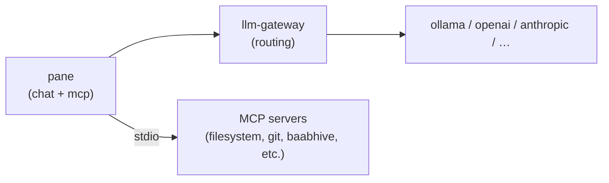
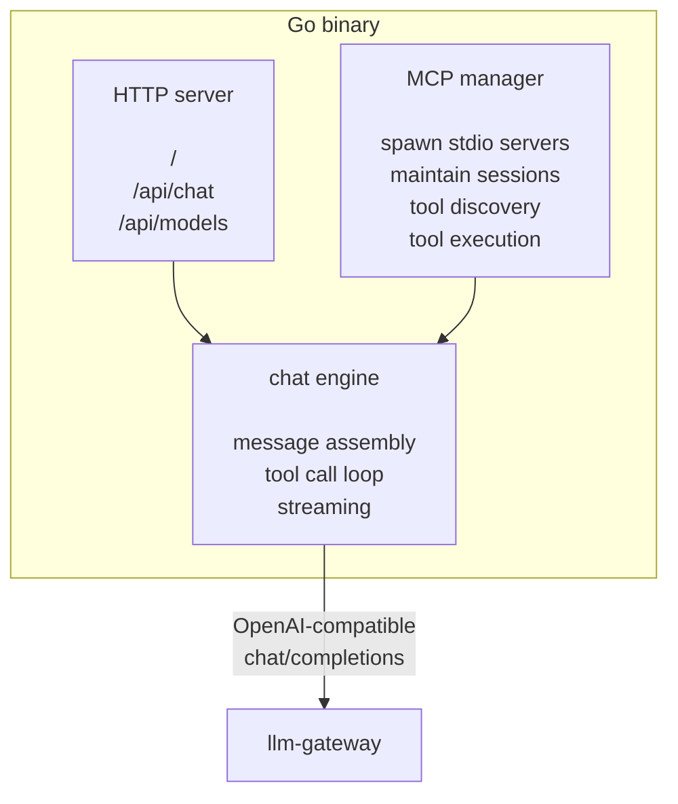
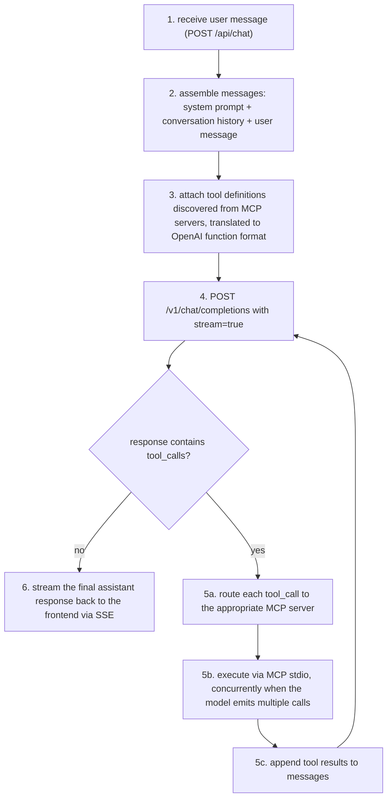
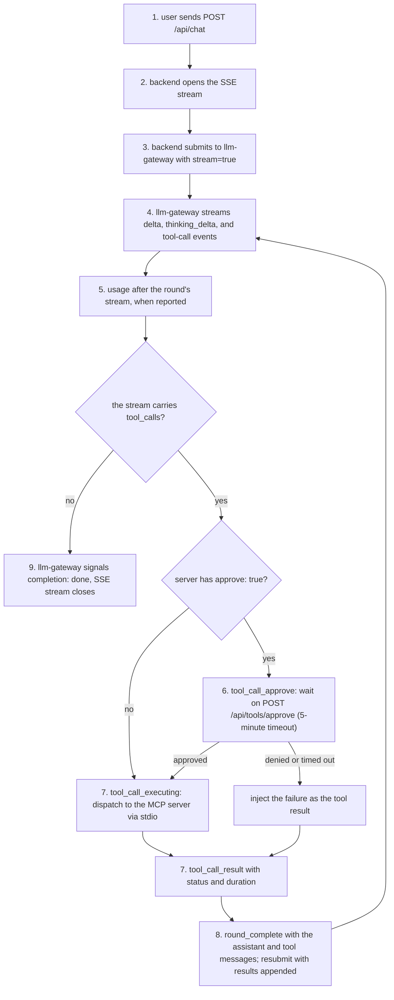

# pane — design document

a thin pane of glass between a human and an LLM. Go binary with an embedded web frontend. first-class MCP stdio support.

## problem

open-webui and its ilk are bloated. they bundle auth, RAG, model management, user management, plugin systems — machinery that belongs elsewhere in the stack. worse, their MCP support is HTTP-only, which means every local MCP server needs a transport adapter just to be reachable.

what's needed is a thin pane of glass between a human and an OpenAI-compatible completions endpoint (llm-gateway), with the ability to wire in MCP stdio servers directly — the same way Claude Desktop does it, but without the Anthropic lock-in.

## positioning

pane sits at the terminal edge of the llm-gateway / mcp-gateway ecosystem:


```mermaid
flowchart LR
    pane["pane<br/>(chat + mcp)"] --> gateway["llm-gateway<br/>(routing)"]
    gateway --> backends["ollama / openai / anthropic / …"]
    pane -- stdio --> mcp["MCP servers<br/>(filesystem, git, baabhive, etc.)"]
```

llm-gateway handles model routing, auth, and backend selection. mcp-gateway handles multi-tenant tool aggregation over zero-trust networking. pane handles the human conversation — it doesn't need to know about any of that plumbing. it just talks OpenAI-compatible chat completions and spawns local MCP servers.

## principles

- **single binary.** build it, run it, open a browser. no node, no docker, no database.
- **embedded frontend.** the web UI is `embed.FS` inside the binary. one artifact to distribute.
- **config, not code.** MCP servers, endpoint URL, model selection — all in a YAML file.
- **stdio MCP only.** pane runs on the same machine as the human. it spawns MCP servers as child processes and talks stdio. HTTP/SSE MCP belongs in mcp-gateway.
- **the backend owns the record, not the conversation.** the record lives on disk as one opaque JSON file per conversation under the data directory, which the binary creates at startup, named for the conversation's id with the id in no field of the body. `/api/chat` stays full-history-per-request and keeps no in-memory conversation state, so the chat path is still a stateless proxy with MCP superpowers. the browser holds a working copy of the record — the mirror model — plus per-browser view state (active conversation, preferences).
- **streaming everywhere.** SSE from backend to frontend. streaming from llm-gateway to backend.

## architecture

### components


```mermaid
flowchart TB
    subgraph binary["Go binary"]
        http["HTTP server<br/><br/>/<br/>/api/chat<br/>/api/models"]
        manager["MCP manager<br/><br/>spawn stdio servers<br/>maintain sessions<br/>tool discovery<br/>tool execution"]
        engine["chat engine<br/><br/>message assembly<br/>tool call loop<br/>streaming"]
        http --> engine
        manager --> engine
    end
    engine -- "OpenAI-compatible<br/>chat/completions" --> gateway["llm-gateway"]
```

### chat engine — the tool call loop

the core of the backend is a standard OpenAI tool-calling loop (`internal/llm/toolloop.go`):


```mermaid
flowchart TD
    a["1. receive user message (POST /api/chat)"] --> b["2. assemble messages: system prompt + conversation history + user message"]
    b --> c["3. attach tool definitions discovered from MCP servers, translated to OpenAI function format"]
    c --> d["4. POST /v1/chat/completions with stream=true"]
    d --> e{"response contains tool_calls?"}
    e -- "no" --> f["6. stream the final assistant response back to the frontend via SSE"]
    e -- "yes" --> g["5a. route each tool_call to the appropriate MCP server"]
    g --> h["5b. execute via MCP stdio, concurrently when the model emits multiple calls"]
    h --> i["5c. append tool results to messages"]
    i --> d
```

two guards bound the loop. a hard iteration cap (`max_iterations` error if exceeded) prevents runaway loops, and a repeated-failure tracker watches for the same tool call failing again and again — after the threshold, the loop forces a final response by telling the model that tool calls are disabled and it must answer with what it has (`repeated_tool_failure` if the model persists anyway).

the frontend sends the full conversation history with each request. the chat path is stateless — it just proxies, executes tools, and streams back. it never reads the session store: a chat request's behavior depends on its own body and nothing an earlier request left behind.

### MCP manager

at startup, the MCP manager (`internal/mcp/manager.go`) reads the config and spawns each configured MCP server as a child process. it holds the stdio pipes and MCP client sessions.

responsibilities:
- **lifecycle:** spawn on startup, monitor stderr, graceful shutdown. a server that fails to spawn is marked `error` and its tools are simply absent; there is no automatic restart of crashed servers.
- **discovery:** call `tools/list` on each server, cache the tool manifests.
- **namespacing:** generate a model-safe callable name for each tool (see translation below) and maintain a routing table from callable name back to (server, tool).
- **translation:** convert MCP tool schemas to OpenAI function-calling format (JSON Schema is the common substrate, so this is mostly structural mapping).
- **execution:** route `tool_calls` from the LLM response to the correct MCP server, call `tools/call` with a per-server timeout (default 30s), return results.

### HTTP API

minimal surface:

| endpoint | method | description |
|---|---|---|
| `/` | GET | serve embedded frontend |
| `/api/health` | GET | health check, returns `{"status": "ok"}` |
| `/api/config` | GET | server defaults for the UI: system prompt, model, separator, and context windows |
| `/api/chat` | POST | chat completion proxy with MCP tool loop. accepts OpenAI-format messages array. returns SSE stream. |
| `/api/models` | GET | proxy to llm-gateway's `/v1/models` |
| `/api/tools` | GET | return discovered MCP tools and server statuses (for frontend display) |
| `/api/tools/approve` | POST | approve or deny a pending tool call (for servers with `approve: true`) |
| `/api/sessions` | GET | list every stored conversation's projection, sorted by updated descending, id ordinal-ascending as the tiebreak |
| `/api/sessions/{id}` | GET | the session document's body, as stored |
| `/api/sessions/{id}` | PUT | upsert the document body under that id (create-or-replace; the frontend owns id generation) |
| `/api/sessions/{id}` | DELETE | delete one conversation |

### API schemas

#### `POST /api/chat`

request body — the frontend sends the full conversation history every time. the backend is stateless.

```json
{
  "model": "qwen2.5:14b",
  "messages": [
    { "role": "user", "content": "Show me groove tag distribution for 90-110 bpm" },
    { "role": "assistant", "content": null, "tool_calls": [
      { "id": "tc_1", "type": "function", "function": { "name": "baabhive_hive_sql_3f9c2ab1d4", "arguments": "{\"sql\": \"SELECT ...\"}" } }
    ]},
    { "role": "tool", "tool_call_id": "tc_1", "content": "[{\"tag\": \"straight-pocket\", \"count\": 842}, ...]" },
    { "role": "assistant", "content": "Here's the distribution..." },
    { "role": "user", "content": "Now filter to only shuffle patterns" }
  ],
  "system_prompt_mode": "default",
  "system_prompt": ""
}
```

the `messages` array uses standard OpenAI chat format, including any tool call/result pairs from prior turns. the system prompt is resolved server-side from `system_prompt_mode`: `default` uses the configured system prompt, `custom` uses the request's `system_prompt`, and `none` sends no system message at all.

response — SSE stream. `Content-Type: text/event-stream`.

#### `GET /api/config`

returns the server-side defaults and context-window facts the UI needs:

```json
{
  "default_system": "You are a helpful assistant.",
  "default_model": "qwen2.5:14b",
  "mcp_separator": "_",
  "context_windows": {
    "qwen2.5:14b": 32768
  },
  "default_context_window": 128000
}
```

`context_windows` and `default_context_window` are omitted when they are not configured. `include_usage` is deliberately absent: it is a backend-side request knob that controls the upstream wire contract, not a frontend setting.

#### `GET /api/models`

passthrough proxy to llm-gateway's `GET /v1/models`. response is the standard OpenAI models list:

```json
{
  "object": "list",
  "data": [
    { "id": "qwen2.5:14b", "object": "model", "owned_by": "ollama" },
    { "id": "llama3.1:8b", "object": "model", "owned_by": "ollama" }
  ]
}
```

#### `GET /api/tools`

returns the discovered MCP tools — each with its source server, original name, and the callable function form sent to the LLM — plus per-server status:

```json
{
  "tools": [
    {
      "server": "baabhive",
      "name": "hive_sql",
      "function": {
        "name": "baabhive_hive_sql_3f9c2ab1d4",
        "description": "Execute a SQL query against the hive database",
        "parameters": {
          "type": "object",
          "properties": {
            "sql": { "type": "string", "description": "SQL query to execute" }
          },
          "required": ["sql"]
        }
      }
    }
  ],
  "servers": {
    "baabhive": { "status": "running", "tools_count": 4 },
    "filesystem": { "status": "running", "tools_count": 6 },
    "git": { "status": "error", "tools_count": 0, "error": "spawn failed: uvx not found" }
  }
}
```

server statuses are `starting`, `running`, or `error`.

#### `/api/sessions`

the session store's four endpoints. the store is a directory of opaque documents: `<data_dir>/sessions/<id>.json`, created at `0700` with documents at `0600`, written atomically (temp file, then rename) under a per-store mutex.

the list returns the rail's projection — the id, which is the file's name, plus `title`, `createdAt`, `updatedAt` read from the body. an empty store returns `{"sessions": []}`, never null:

```json
{
  "sessions": [
    { "id": "V1StGXR8_Z", "title": "reading the roadmap", "createdAt": 1755600000000, "updatedAt": 1755640000000 }
  ]
}
```

the order is updated descending, with the id ordinal-ascending as the tiebreak — ordinal meaning UTF-8 byte order, the same comparison the rail applies on screen, so screen order and disk order agree for every id the store accepts.

the document round-trips byte-for-byte. a `PUT` stores the body as sent and a later `GET` returns those bytes unchanged; the id rides in the path and is a field of no body, so there is nothing to strip on the way in and nothing to inject on the way out. the backend never interprets the content — it validates only that the body is a well-formed JSON object under strict intake, which is also what makes a file that is renamed or hand-edited on disk simply a conversation under its new name, or the same conversation with new content.

| condition | status | body |
|---|---|---|
| `PUT` body that is not a JSON object, or fails strict intake (duplicate keys, trailing data) | `400` | `{"error": "..."}` naming the reason |
| an id that is not a safe single file name | `400` | `{"error": "unsafe session id: '...'"}` |
| `GET` or `DELETE` of a missing id | `404` | `{"error": "session 'id' not found"}` |
| `PUT` body above the 32 MiB cap | `413` | `{"error": "..."}` |
| `GET` of a stored file that no longer parses (damaged out of band) | `500` | `{"error": "session 'id' is not a valid document"}` |
| an operational store failure — write, rename, permission | `500` | `{"error": "..."}` naming the filesystem failure |
| `PUT` / `DELETE` success | `204` | empty |

a disk failure is a server fault and never a `4xx`: the frontend shows the decoded message either way, so a broken disk is never mistaken for a bad request. an id that is legal on disk but reserved in a URL (`issue#1`) is addressed percent-encoded (`/api/sessions/issue%231`); the mux hands the handler the decoded segment.

### SSE streaming protocol

this is the critical contract between backend and frontend. the backend emits a sequence of typed SSE events that let the frontend render the full tool-call loop in real time. event data types live in `internal/sse/writer.go`; the consuming state machine is `ui/src/hooks/useChat.ts`.

#### event types

```
event: thinking_delta
data: {"content": "the user wants the README, so first i should check the repo layout"}

event: delta
data: {"content": "Here's the"}

event: tool_call_start
data: {"index": 0, "id": "tc_1", "name": "baabhive_hive_sql_3f9c2ab1d4"}

event: tool_call_args
data: {"index": 0, "id": "tc_1", "arguments_partial": "{\"sql\": \"SELECT tag, COUNT(*) ..."}

event: usage
data: {"prompt_tokens": 41230, "completion_tokens": 512, "total_tokens": 41742}

event: tool_call_executing
data: {"index": 0, "id": "tc_1", "name": "baabhive_hive_sql_3f9c2ab1d4"}

event: tool_call_result
data: {"index": 0, "id": "tc_1", "name": "baabhive_hive_sql_3f9c2ab1d4", "status": "complete", "content": "[{\"tag\": \"straight-pocket\", ...}]", "duration_ms": 12}

event: round_complete
data: {"assistant": {"role": "assistant", "content": null, "tool_calls": [...]}, "tool_messages": [{"role": "tool", "tool_call_id": "tc_1", "content": "..."}]}

event: delta
data: {"content": "The corpus leans heavily toward straight-pocket grooves..."}

event: done
data: {}
```

`round_complete` fires after each tool round, carrying the assistant message (with its tool calls) and the tool result messages — the frontend appends these to the conversation so the history it sends next turn matches what the model actually saw.

`thinking_delta` is the model's reasoning, streamed one token at a time and interleaved with `delta` and the tool-call events in upstream order. it is display-only by construction: the backend `llm.Message` type carries no reasoning field, so reasoning is never accumulated, never echoed in the `round_complete` payload, and never re-sent to the model. the upstream stream reader tolerates both known reasoning field spellings — `reasoning` (openai o-style) and `reasoning_content` (the vllm / sglang family) — and emits a single pane field regardless of which one appears on the wire.

`usage` carries the upstream's `prompt_tokens`, `completion_tokens`, and `total_tokens` scalars unchanged. it fires once per round when the upstream reports usage, after that round's content and tool-call stream events and before `round_complete`. it is absent when `include_usage` is off or when the upstream declines to report usage; either case leaves the turn otherwise unchanged.

for servers with `approve: true`, an approval gate is inserted before `tool_call_executing`:

```
event: tool_call_approve
data: {"index": 0, "id": "tc_1", "name": "filesystem_write_file_8a1c44b09e", "arguments": "{\"path\": \"...\", \"content\": \"...\"}"}
```

the frontend renders an approve/deny prompt inline in the tool block. the user's decision is sent via:

```
POST /api/tools/approve
{ "id": "tc_1", "approved": true }
```

the backend holds the SSE stream open waiting on this, with a 5-minute timeout. on approval, it proceeds to `tool_call_executing`. on denial, it injects a denial as the tool result and lets the LLM continue. on timeout, the tool call fails with `approval_timeout`.

tool-level failures are not stream errors — they arrive as `tool_call_result` with `status: "error"` and an `error_code`:

| error_code | meaning |
|---|---|
| `denied` | user denied the approval prompt |
| `approval_timeout` | no approval decision within 5 minutes |
| `cancelled` | request context cancelled mid-execution |
| `malformed_arguments` | LLM produced arguments that don't parse as JSON |
| `execution_error` | the MCP server returned an error or the call timed out |

the failure is injected into the messages as a `role: tool` result, and the model decides how to respond — it often recovers gracefully ("I wasn't able to run that query, but here's what I can tell you...").

stream-level errors use `event: error` and do close the stream:

```
event: error
data: {"code": "upstream_unreachable", "message": "connection refused"}
```

| code | meaning |
|---|---|
| `upstream_unreachable` | can't connect to llm-gateway |
| `upstream_error` | llm-gateway returned an HTTP error or the stream broke mid-response |
| `repeated_tool_failure` | the model kept calling tools after the loop forced a final answer |
| `max_iterations` | tool call loop exceeded the iteration cap |

#### event lifecycle for a single turn


```mermaid
flowchart TD
    a["1. user sends POST /api/chat"] --> b["2. backend opens the SSE stream"]
    b --> c["3. backend submits to llm-gateway with stream=true"]
    c --> d["4. llm-gateway streams delta, thinking_delta, and tool-call events"]
    d --> u["5. usage after the round's stream, when reported"]
    u --> e{"the stream carries tool_calls?"}
    e -- "no" --> h["9. llm-gateway signals completion: done, SSE stream closes"]
    e -- "yes" --> g{"server has approve: true?"}
    g -- "yes" --> i["6. tool_call_approve: wait on POST /api/tools/approve (5-minute timeout)"]
    g -- "no" --> j["7. tool_call_executing: dispatch to the MCP server via stdio"]
    i -- "approved" --> j
    i -- "denied or timed out" --> k["inject the failure as the tool result"]
    j --> l["7. tool_call_result with status and duration"]
    k --> l
    l --> m["8. round_complete with the assistant and tool messages; resubmit with results appended"]
    m --> d
```

#### multiple tool calls in one turn

some models emit multiple tool calls in parallel. the backend handles this by:
- emitting `tool_call_start` for each call as they arrive in the stream
- executing all tool calls concurrently (goroutines)
- emitting `tool_call_result` for each as they complete (order may differ from call order)
- emitting `round_complete` and re-submitting once all are complete

the frontend matches events by `id` to render each tool block independently.

### MCP-to-OpenAI schema translation

MCP `tools/list` returns tools in MCP format. pane translates these to OpenAI function-calling format for the llm-gateway request. the schema mapping is mechanical — `description` and `inputSchema` pass through (both are JSON Schema) — but the function name is generated, not joined:

- the callable name is `sanitize(server_tool)` truncated and suffixed with a 10-character sha256 hash of the (server, tool) identity, capped at 64 characters — the OpenAI function-name limit. e.g. `baabhive` + `hive_sql` → `baabhive_hive_sql_3f9c2ab1d4`.
- sanitization strips characters that models mishandle in function names; the hash suffix guarantees uniqueness even when sanitization or truncation would collide.
- when a tool call comes back from the LLM, the manager resolves the callable name through its routing table — no string splitting — and dispatches `tools/call` to the right server with `function.arguments` passed directly as MCP arguments.

MCP `tools/call` returns `content` as an array of content blocks (text, image, etc.). pane serializes the text blocks as a JSON string for the OpenAI `tool` message role's `content` field.

note: the config exposes `mcp.separator` (surfaced to the UI via `/api/config` as `mcp_separator`), but the callable-name builder currently hardcodes `_` — the knob is wired through but unused.

### frontend

a React/TypeScript SPA built with Vite, embedded in the Go binary via `go:embed`. the build output (`ui/dist/`) is the only thing the Go binary sees — no node runtime at deploy time. same pattern as zrok. `ui/embed_stub.go` (build tag `no_ui`) enables headless builds.

```
ui/
├── embed.go              # //go:embed dist (build tag: !no_ui)
├── embed_stub.go         # empty FS (build tag: no_ui)
├── middleware.go         # SPA middleware: /api/ passthrough, index.html fallback
├── index.html
├── vite.config.ts
└── src/
    ├── main.tsx
    ├── App.tsx               # top-level layout, the conversation surface
    ├── index.css
    ├── types.ts              # Conversation, Message, ToolCall, SSEEvent, etc.
    ├── lib/
    │   ├── sse.ts            # SSE stream parser (pane's protocol)
    │   ├── sessionStore.ts   # the SessionStore interface and its backend adapter
    │   └── exportMarkdown.ts # conversation-to-markdown export
    ├── hooks/
    │   ├── useChat.ts        # streaming, tool call state machine, approvals
    │   ├── useConfig.ts      # GET /api/config
    │   ├── useSessions.ts    # the mirror hook: hydration, diff-mirror, serial chain
    │   ├── useLocalStorage.ts
    │   ├── useModels.ts      # GET /api/models
    │   └── useTools.ts       # GET /api/tools
    └── components/
        ├── ChatView.tsx
        ├── MessageBubble.tsx
        ├── MarkdownCodeBlock.tsx
        ├── ToolCallBlock.tsx
        ├── Toolbar.tsx
        ├── icons.tsx
        ├── ModelSelector.tsx
        ├── ContextMeter.tsx
        ├── ToolPanel.tsx
        ├── ConversationList.tsx
        └── SystemPromptEditor.tsx
```

#### frontend types

the shapes the frontend works with (`ui/src/types.ts`), abbreviated:

```typescript
// the session document: exactly what one file under the data directory
// holds. no id field -- the id is the store's key, the file's name.
interface Conversation {
  title: string;           // first user message, truncated to 50 chars
  messages: Message[];
  createdAt: number;
  updatedAt: number;
  usage?: UsageRecord | null;
}

// the working copy's element: the store's key paired with the document it
// addresses, so the id stays out of the body and in hand for every operation.
interface StoredConversation {
  id: string;              // nanoid, or whatever the file on disk is named
  doc: Conversation;
}

// the rail's projection, as GET /api/sessions reports it.
interface SessionSummary {
  id: string;
  title: string;
  createdAt: number;
  updatedAt: number;
}

interface UsageRecord {
  promptTokens: number;
  completionTokens: number;
  totalTokens: number;
  model: string;
  at: number;              // epoch milliseconds
}

interface Message {
  role: 'system' | 'user' | 'assistant' | 'tool';
  content: string | null;
  tool_calls?: ToolCall[];                            // assistant messages with tool invocations
  tool_call_results?: Record<string, ToolCallResult>; // render state for completed tool calls
  tool_call_id?: string;                              // tool result messages
  thinking?: string;                                  // the round's reasoning, display-only
  thinkingCollapsed?: boolean;                        // per-block collapse state (undefined = expanded)
}

interface ConfigResponse {
  default_model: string;
  default_system: string;
  mcp_separator: string;
  context_windows: Record<string, number>;
  default_context_window: number;
}

type SSEEvent =
  | { type: 'delta'; content: string }
  | { type: 'thinking_delta'; content: string }
  | { type: 'tool_call_start'; index: number; id: string; name: string }
  | { type: 'tool_call_args'; index: number; id: string; arguments_partial: string }
  | { type: 'tool_call_approve'; index: number; id: string; name: string; arguments: string }
  | { type: 'tool_call_executing'; index: number; id: string; name: string }
  | { type: 'tool_call_result'; index: number; id: string; name: string; status: string; error_code?: string; content: string; duration_ms: number }
  | { type: 'usage'; prompt_tokens: number; completion_tokens: number; total_tokens: number }
  | { type: 'round_complete'; assistant: Message; tool_messages: Message[] }
  | { type: 'error'; code: string; message: string; tool_call_id?: string }
  | { type: 'done' };
```

#### frontend state flow

the `useChat` hook manages the streaming lifecycle. the chat POST returns an SSE body which the hook reads via `fetch` and a hand-rolled parser (`lib/sse.ts`) — EventSource can't POST, so the stream is consumed from the response body directly.

1. user presses send
2. append user message to `conversation.messages`
3. POST `/api/chat` with the full messages array
4. read the SSE response body through the parser
5. for each SSE event:
   - `delta` → append to the streaming buffer, render with cursor
   - `thinking_delta` → append to the streaming thinking buffer, render the live thinking block
   - `tool_call_start` → create a ToolCallBlock in `loading` state
   - `tool_call_args` → update the ToolCallBlock with streaming arguments
   - `tool_call_approve` → flip the ToolCallBlock to `awaiting_approval`, show approve/deny buttons
   - `tool_call_executing` → flip the ToolCallBlock to `executing` state
   - `tool_call_result` → flip the ToolCallBlock to `complete` or `error`, show the result (collapsible)
   - `usage` → replace the conversation's usage record with the round's token counts, stamped with the selected model and current time
   - `round_complete` → commit the assistant and tool messages to the conversation history, grafting the round's accumulated thinking onto the committed assistant message
   - `error` → show an inline error (tool-level) or a stream-level error
   - `done` → finalize the assistant message
6. mirror the conversation to the store

tool call block states: `loading` → `args_streaming` → [`awaiting_approval` →] `executing` → `complete` | `error`. the approval state only appears for servers with `approve: true`.

thinking is display-only, end to end. the frontend owns its life from stream to commit to storage: `thinking_delta` accumulates per round, the committed assistant message carries the round's `thinking` (and its per-block `thinkingCollapsed` state), and both persist in the conversation's stored document — a reload returns the conversation exactly as the reader left it, collapsed blocks included. when the hook builds the `/api/chat` request body, it strips `thinking` and `thinkingCollapsed` from every message, so reasoning never reaches the backend; the backend's `llm.Message` type carries no reasoning field, so nothing reaches the model either. a response with no thinking tokens renders exactly as it did before — no block, no placeholder. accepted residual: thinking text is stored with no cap, so a conversation with a thinking-heavy model grows accordingly — bounded now by the 32 MiB document cap rather than by a browser quota.

the usage record rides on the conversation document, round-trips through the store with the history it describes, and is seeded into hook state when that conversation loads. starting or retrying a request and any history replacement through the chat hook — clear, delete, or abort — resets the live record; a conversation switch replaces it with the destination conversation's seed. a model switch leaves the stored record keyed to the model that produced it, so the mismatch honestly displays `?`. each arriving `usage` event replaces the record, so the last round wins. storage remains an implementation detail of the conversation rather than something the meter reads directly.

#### the storage mirror

state is the working truth for the tab's lifetime; the disk store is its durable mirror, hydrated on load and persisted on every change. the app talks only to one interface (`lib/sessionStore.ts`), whose single implementation fetches against `/api/sessions*`:

```typescript
interface SessionStore {
  list(): Promise<SessionSummary[]>
  get(id: string): Promise<Conversation | null>
  save(id: string, doc: Conversation): Promise<void>
  remove(id: string): Promise<void>
}
```

every operation takes the id explicitly and every item URL is percent-encoded, since a safe filename is not necessarily a URL-safe string. every response is checked against its documented status — `200` for list and get (a `404` is the one case that resolves to `null`), `204` for the mutations — and any other status rejects carrying the backend's decoded message. there is no warn-and-swallow path: a save that never reached disk surfaces as a failure, never as a success.

`useSessions()` is the mirror hook, shaped like `useLocalStorage` so the code around it keeps its form. it returns the working copy, an update function with the same call shape, a `loading` flag, an `error` slot, and `remove`:

- **hydration.** on mount, a `list()` then a `get()` for each listed id, installed in the order the list returned them. `loading` stays true until the copy is fully installed — the list succeeded and every listed id's get has settled — and flips in the same step the copy installs: one boundary, one meaning. a failed `list` settles nothing; the copy stays empty, the gate stays closed over an estate the tab could not read, and the recovery is a reload after the backend recovers. a `get` that fails for one id drops that entry and still settles the rest.
- **the mirror runs at call time.** `setConversations` derives the next copy from the ref it holds, installs it into the ref and the React state, and enqueues the diff's saves before returning — never inside React's updater (react may invoke updaters more than once) and never in a later effect (which settles after the state it mirrors has logically moved). added or reference-changed documents are saved; removals are not diffed, since the destructive handler calls `remove(id)` explicitly to await its settle.
- **one serial chain.** every store mutation joins one promise chain in invocation order, so a `remove` issued after a save cannot execute ahead of it and re-create the file. the only reader is the initial hydration, and the session gate keeps every mutation behind it. there is no coalescing: each mirrored commit is one PUT.

three app-level guards ride on top:

- **selection is a find, not a fetch.** `conversations.find(c => c.id === activeId)` over the working copy, loaded into the chat hook by a layout effect — before paint, so no painted frame shows the composer enabled while the chat area, meter, or commit snapshot still hold another conversation's state. at the hydration-completion transition the effect reconciles a retained selection against the installed copy: a match loads its document, and an id naming no stored conversation (a pre-arc `pane:activeConversation`) clears the selection rather than following it.
- **a read is not a write.** the commit effect holds a snapshot of the (messages, usage) references the last mirrored document carries, seeded when the sync effect loads a conversation and advanced on every commit. while chat's state is still those references it issues no write, so selecting or reloading a conversation re-stamps neither `updatedAt` nor the rail's order. both sides normalize the optional `usage` field identically, so a document that omits the key reads as unchanged either way.
- **the session gate.** every session-mutating entry point — both new-conversation controls, send (button and enter), retry — is closed while hydration is incomplete or a delete of the active conversation is in flight. the controls render disabled, the handlers refuse, and the composer's gate sits before the input clear, so the typed text survives and the input stays editable. selection is closed during the destructive window too: the sync effect re-attaches commit ownership, so a selection made there could commit a save behind the in-flight delete and re-create the file after it.

the rail renders in (updated descending, id ordinal-ascending) order — the same comparator the store's list applies, with the id compared as its `TextEncoder` bytes so screen order and disk order agree. a commit that stamps `updatedAt` moves the conversation to the top in the same render.

when a store operation fails, the app shows one quiet line near the composer holding the most recently failed operation's decoded message; the next successful store operation clears it. a failed `/api/config` fetch rides the same line behind it, persisting until reload since the binary it accuses sits behind the page. the ordering is fixed — the session error when present, otherwise the config error — so a persistent failure can never mask a live one.

what stays in the browser: `pane:activeConversation` and `pane:chatPreferences`, per-browser view state a second machine pointed at the same store has no business restoring. pre-arc `pane:conversations` data is never imported and never touched; it stays in the profile that created it until the user clears browser data.

the UI:

- **chat view.** messages rendered as markdown (with syntax-highlighted code blocks). streaming token display with a visible cursor/caret. assistant messages that carry thinking render a quiet thinking block above their content — live and always expanded while the turn streams, resting expanded at turn end, collapsible by the reader with the collapsed state persisting per message.
- **tool call visibility.** when the LLM invokes a tool, show it inline — the tool name, arguments (collapsible), and result (collapsible). not hidden, not modal — part of the conversation flow. think Claude Desktop's tool use blocks. each round's thinking block sits above the tool calls that round motivated, so the reader sees the model reason its way into a call.
- **model selector.** the toolbar's model control: a glyph beside a compact dropdown populated from `/api/models`. the dropdown's popup keeps the browser's native styling — like scrollbars, not worth fighting (the family's recorded decision). persisted in localStorage.
- **context meter.** the readout in the bar's signal column. it compares the latest `prompt_tokens` measurement with the selected model's exact configured window, then shifts from cool below 50%, to warm from 50–80%, to hot at 80% and above. `?` names the distinct unknown state in its tooltip: no usage yet, a measurement from another model, or no configured window for the measured model.
- **tool panel.** slide-out sidebar below the bar, opened from the toolbar's tools glyph (lit while open, wearing the tool count as a badge while the count is positive) showing discovered MCP tools and server statuses.
- **system prompt.** the toolbar's description glyph — lit on the non-default modes — opens a modal holding the mode select (default/custom/none) and, for custom, the text. escape and outside click close it, returning focus to the glyph. mode and text persist in localStorage.
- **conversation management.** new conversation and export as toolbar actions, the history rail — the working copy of the disk store — opened from the toolbar's conversations glyph, delete, markdown export. there is no clear-all: bulk-wiping the estate is the operator's file operation on the data directory.

no auth. no user management. no settings pages. no plugin system.

### aesthetic direction

pane should feel like a calm, literate workspace — closer to Claude Desktop than to a terminal emulator. the spiritual reference is the quiet confidence of a well-set book page: generous whitespace, measured typography, nothing competing for attention.

**typography.** Source Serif 4 as the primary typeface — for the UI chrome, message text, and anywhere prose appears. it's warm, readable at body sizes, and gives pane a distinctive character that separates it from the monospace-everything crowd. JetBrains Mono for code blocks, tool call arguments, and tool results — the places where alignment matters. both are variable fonts bundled via @fontsource-variable and embedded in the binary, so the UI renders identically offline with no third-party font requests. the contrast between serif prose and mono code creates a natural visual hierarchy.

**color.** light and dark themes, defaulting to system preference. the palette is restrained — warm neutrals (not blue-gray), with a single accent color for interactive elements and the streaming cursor. think claude.ai's warm sand/cream in light mode, soft charcoal in dark mode. avoid cold grays and saturated colors.

**layout.** a 2.6rem toolbar spans the top of the window over the rail and chat — the family's standing chrome: a centered glyph cluster in whitespace-set groups (conversation, reply, machinery), a signal column at the right, a hairline below. the cluster centers on the window and wraps rather than colliding on narrow windows; the rail and the tool panel anchor to the bar's rendered height, so a wrapped, taller bar never obscures them. below it, a centered conversation column with comfortable max-width (960px). sidebar for conversations, collapsible. messages should breathe — generous vertical spacing between turns. tool call blocks are visually distinct but not disruptive: slightly inset, muted background, with expand/collapse affordance.

**interaction.** subtle transitions. no bouncing, no sliding panels, no loading spinners beyond a simple pulsing dot for streaming. the interface should feel like it's already there, waiting — not performing.

the overall impression: a tool made by someone who reads books.

## configuration

```yaml
# ~/.config/pane/config.yaml (or ./pane.yaml)

# the OpenAI-compatible endpoint to proxy to
endpoint: http://localhost:18080/v1

# bearer token for LLM endpoint authentication (optional)
#api_key: sk-...

# default model (overridable in UI)
model: qwen2.5:14b

# system prompt (overridable in UI)
system: "You are a helpful assistant."

# listen address
listen: 127.0.0.1:8400

# location of the session store (default shown)
#data_dir: ~/.local/share/pane

# context windows per model id, for the toolbar's context meter.
# models with no entry and no default show '?' in the meter.
#context_windows:
#  qwen2.5:14b: 32768
#default_context_window: 128000

# ask the upstream for token usage on every request (default true).
# set false for an endpoint that rejects the stream_options field.
#include_usage: false

# MCP servers — same conceptual model as Claude Desktop
mcp:
  servers:
    filesystem:
      command: npx
      args:
        - -y
        - "@modelcontextprotocol/server-filesystem"
        - "/home/michael/projects"
      env:
        NODE_ENV: production
      approve: true              # human-in-the-loop: confirm before executing
      timeout: 30s

    baabhive:
      command: /home/michael/bin/baabhive-mcp
      args:
        - --db
        - /home/michael/data/baabhive.db
```

the config cascade, lowest to highest priority: compiled defaults → `~/.config/pane/config.yaml` → `./pane.yaml` → `--config` flag. loading uses `dd.MergeYAMLFile` (`internal/config/config.go`).

`data_dir` is where the session store lives. it resolves to the configured value when set — a leading `~` expanding to the user's home directory — else `$XDG_DATA_HOME/pane`, else `~/.local/share/pane`; the documents sit in a `sessions/` subdirectory under it, leaving room for future disk data in the same home. the store is always on and has no other setting, so `/api/config` reports nothing about it.

## dependencies

### Go
- **`mark3labs/mcp-go`** — Go MCP SDK. handles stdio transport, client sessions, tool discovery and execution.
- **`spf13/cobra`** — CLI structure (`pane`, `pane new`, `pane version`).
- **`michaelquigley/df/dl`** — logging (per project convention).
- **`michaelquigley/df/dd`** — config marshaling (per project convention).
- **`michaelquigley/push/build`** — shared versioning: version/commit/date stamped via ldflags in CI; `pane version` reports `build.Detail()`. developer builds fall back to `v0.1.x [developer build]`.
- **hand-rolled LLM client** (`internal/llm`) — OpenAI-compatible chat completions, streaming, function calling. deliberately not a third-party library; see project rules.
- **standard library** — `net/http`, `embed`, `encoding/json`, `os/exec`.

### Frontend
- **React 19** + **TypeScript** — UI framework.
- **Vite** — build tooling. fast dev server, clean production output for embedding.
- **react-markdown** + **remark-gfm** — markdown rendering in messages.
- **react-syntax-highlighter** (prism) — code blocks.
- **@fontsource-variable/source-serif-4** + **@fontsource-variable/jetbrains-mono** — bundled fonts.
- **nanoid** — conversation ids.
- minimal beyond that. no state management library (React context + hooks is sufficient for this scope). no component library — pane's aesthetic is custom.

## error handling

pane has three failure domains, each with a distinct recovery strategy.

### MCP server failures

| failure | backend behavior | frontend rendering |
|---|---|---|
| server fails to spawn | log error, mark server `error` in `/api/tools`, exclude its tools | server shows error status in tool panel |
| tool call returns error | wrap as tool result with `error_code: execution_error`, inject into messages as `role: tool` | tool block shows error state; LLM sees the error and can respond to it |
| tool call times out | per-server timeout (default 30s) cancels the call, same `execution_error` path | same inline rendering |
| same call fails repeatedly | failure tracker forces a final response without tools | conversation continues with the model's best answer |

the key principle: tool errors are not stream errors. when a tool fails, pane injects the failure as a tool result and lets the LLM continue. the SSE stream only closes on unrecoverable errors.

### llm-gateway failures

| failure | backend behavior | frontend rendering |
|---|---|---|
| connection refused | emit `event: error` with `code: upstream_unreachable`, close stream | error shown in conversation |
| HTTP 4xx/5xx or stream interrupted | emit `event: error` with `code: upstream_error`, close stream | streaming content preserved, error appended |
| malformed SSE from gateway | log warning, skip malformed chunk, continue | invisible to user unless it corrupts the response |

### frontend failures

| failure | behavior |
|---|---|
| SSE connection dropped (network) | auto-reconnect not attempted (stateless request model); the partial turn remains visible |
| backend not running | API fetches fail; the UI loads, the rail is empty, the error line names the failed list, and the session gate stays closed until a reload after recovery |
| a store operation fails (save, delete, or a hydration `get`) | the screen keeps what state holds, the error line names the failure, and the next successful store operation clears it |
| `/api/config` fetch fails | the error line names it and points at restart-and-reload, persisting until reload; the rail and stored conversations remain usable, while the model list stays empty and a send without an explicit model override fails through the chat error path |
| the tab is closed or reloaded while a commit's PUT is in flight | that commit's tail is lost; a reload after the turn settles restores the complete turn |
| a delete of the active conversation fails | the selection stays in its post-delete state with commit ownership detached; the disk still holds the conversation, and a reload restores it |

## what pane is _not_

- **not a model runner.** it doesn't touch GGUF files or GPU memory. that's Ollama's job.
- **not a gateway.** it doesn't route between models or manage API keys. that's llm-gateway's job.
- **not multi-tenant.** one human, one browser, one instance. multi-user MCP is mcp-gateway's job.
- **not a framework.** there's no plugin API, no extension points, no SDK. pane is an appliance.

## deferred

things the original design contemplated that remain unbuilt, plus gaps observed since:

1. **tool enable/disable.** the original design specified `POST /api/tools/toggle` and a `tools_disabled` chat field; neither was built. all discovered tools are always attached. the tool panel displays but does not toggle.
2. **MCP server restart.** no automatic restart of crashed servers (the design called for 3 retries with backoff). a dead server's tools simply disappear until pane restarts.
3. **image/multimodal.** llm-gateway supports vision models; pane doesn't wire image paste/upload through yet.
4. **MCP resources & prompts.** MCP defines resources and prompts in addition to tools. tools are the critical path; resources and prompts can come later.
5. **config hot reload.** the MCP manager doesn't watch the config file; server changes require a restart.
6. **cross-tab sync is reload-scoped.** two tabs hold independent working copies of the same disk record: a change in one is on disk immediately but invisible to the other until it reloads, and two writers to one conversation resolve last-write-wins. the named path to tightening this is a server-assigned version the store increments on every accepted save, which a stale save would be rejected against.
7. **`mcp.separator` is vestigial.** the config knob and `/api/config` field exist but the callable-name builder hardcodes `_`. either wire it through or remove it.

## build & run

```bash
make build   # npm install + frontend build + go install ./... (default target)
make test    # go test ./... -count=1 && go vet ./...
make clean   # go clean, remove installed binaries, ui/dist, ui/node_modules
```

the binary creates its data directory at startup and fails loudly if it cannot: an appliance whose record cannot be written should not serve an empty rail that pretends to remember. an ephemeral container that wants the record to outlive itself points `data_dir` at a mounted volume.

```bash
pane                    # start server (default command, serves on :8400, spawns MCP servers)
pane new                # generate pane.yaml in current directory
pane version            # show version
pane --config ./my.yaml # start with explicit config
pane -v                 # verbose logging (debug level)
```

dev workflow:

```bash
# terminal 1: go backend
go run ./cmd/pane --config ./dev.yaml

# terminal 2: vite dev server (hot reload, proxies /api to :8400)
cd ui && npm run dev
```

open `http://localhost:5173` for dev, `http://localhost:8400` for production.

### versioning & releases

versioning rides on the shared push infrastructure. CI (`.github/workflows/ci.yml`) lints and tests on every branch, then builds a stamped linux-amd64 binary using `ldflags.sh`/`version.sh` from the push repo — version, commit, build date, branch, and builder are injected into `github.com/michaelquigley/push/build`. pushing a `v*` tag produces a draft GitHub release with the packaged artifact. local `make build` binaries are unstamped and report `v0.1.x [developer build]`. release history lives in `CHANGELOG.md` (one `## vX.Y.Z` section per release).
