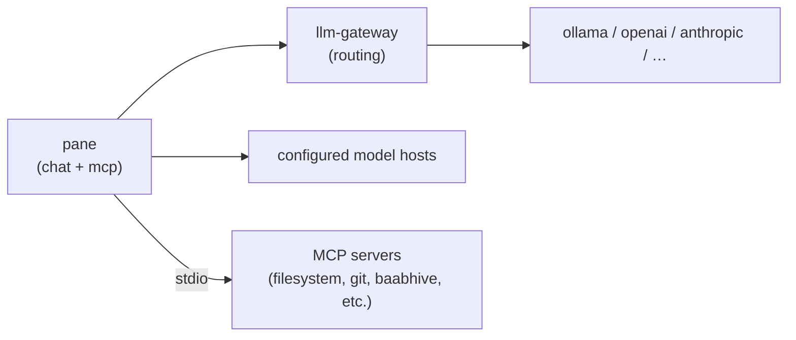
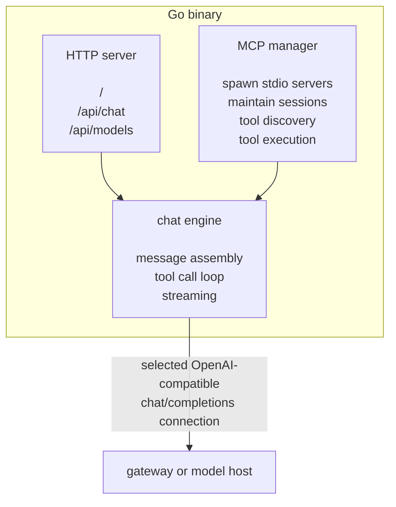
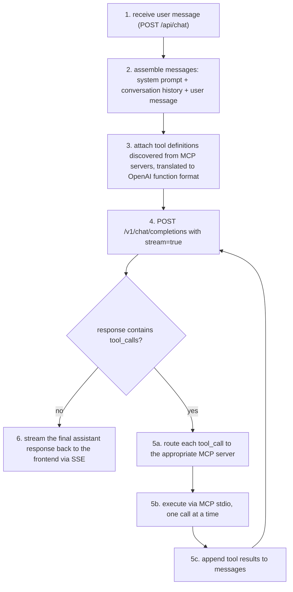
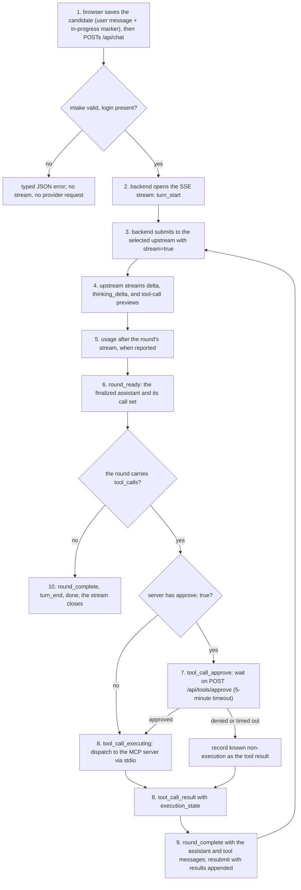

# pane — design document

a thin pane of glass between a human and an LLM. Go binary with an embedded web frontend. first-class MCP stdio support.

## problem

open-webui and its ilk are bloated. they bundle auth, RAG, model management, user management, plugin systems — machinery that belongs elsewhere in the stack. worse, their MCP support is HTTP-only, which means every local MCP server needs a transport adapter just to be reachable.

what's needed is a thin pane of glass between a human and OpenAI-compatible completions endpoints, with the ability to wire in MCP stdio servers directly — the same way Claude Desktop does it, but without the Anthropic lock-in.

## positioning

pane sits at the terminal edge of the llm-gateway / mcp-gateway ecosystem and can also connect to explicitly configured model hosts:


```mermaid
flowchart LR
    pane["pane<br/>(chat + mcp)"] --> gateway["llm-gateway<br/>(routing)"]
    gateway --> backends["ollama / openai / anthropic / …"]
    pane --> hosts["configured model hosts"]
    pane -- stdio --> mcp["MCP servers<br/>(filesystem, git, baabhive, etc.)"]
```

llm-gateway can handle dynamic routing, auth, and backend selection. pane also supports a small explicit registry in which each UI-visible alias names one fixed connection. this is configuration-driven selection, with no discovery across hosts, load balancing, or failover. mcp-gateway handles multi-tenant tool aggregation over zero-trust networking. pane handles the human conversation, talks OpenAI-compatible chat completions, and spawns local MCP servers.

## principles

- **single binary.** build it, run it, open a browser. no node, no docker, no database.
- **embedded frontend.** the web UI is `embed.FS` inside the binary. one artifact to distribute.
- **config, not code.** MCP servers, endpoint URLs, model connections, and model selection — all in a YAML file.
- **stdio MCP only.** pane runs on the same machine as the human. it spawns MCP servers as child processes and talks stdio. HTTP/SSE MCP belongs in mcp-gateway.
- **the backend owns the record, not the conversation.** the record lives on disk as one opaque JSON file per conversation under the data directory, which the binary creates at startup, named for the conversation's id with the id in no field of the body. `/api/chat` stays full-history-per-request and keeps no in-memory conversation state, so the chat path is still a stateless proxy with MCP superpowers. the browser holds a working copy of the record — the mirror model — plus per-browser view state (active conversation, preferences).
- **streaming everywhere.** SSE from backend to frontend. streaming from the selected upstream to backend.

## architecture

### components


```mermaid
flowchart TB
    subgraph binary["Go binary"]
        http["HTTP server<br/><br/>/<br/>/api/chat<br/>/api/models"]
        manager["MCP manager<br/><br/>spawn stdio servers<br/>maintain sessions<br/>tool discovery<br/>tool execution"]
        engine["chat engine<br/><br/>message assembly<br/>tool call loop<br/>streaming"]
        http --> engine
        manager --> engine
    end
    engine -- "selected OpenAI-compatible<br/>chat/completions connection" --> upstream["gateway or model host"]
```

### chat engine — the tool call loop

the core of the backend is a standard OpenAI tool-calling loop (`internal/llm/toolloop.go`):


```mermaid
flowchart TD
    a["1. receive user message (POST /api/chat)"] --> b["2. assemble messages: system prompt + conversation history + user message"]
    b --> c["3. attach tool definitions discovered from MCP servers, translated to OpenAI function format"]
    c --> d["4. POST /v1/chat/completions with stream=true"]
    d --> e{"response contains tool_calls?"}
    e -- "no" --> f["6. stream the final assistant response back to the frontend via SSE"]
    e -- "yes" --> g["5a. route each tool_call to the appropriate MCP server"]
    g --> h["5b. execute via MCP stdio, one call at a time"]
    h --> i["5c. append tool results to messages"]
    i --> d
```

two guards bound the loop. a hard iteration cap (`max_iterations` error if exceeded) prevents runaway loops, and a repeated-failure tracker watches for the same tool call failing again and again — after the threshold, the loop forces a final response by telling the model that tool calls are disabled and it must answer with what it has (`repeated_tool_failure` if the model persists anyway).

the chat-completions adapter validates each model round before the loop can execute calls. a `tool_calls` finish must carry complete function metadata and object-valued arguments, followed by `[DONE]`; `stop` must carry no calls. a `length` or `content_filter` finish, missing `[DONE]`, conflicting finish, or malformed call fails the round without executing any of its calls. a received MCP reply, including an `IsError` reply, is known work; an error or missing reply after the MCP client call starts is an unknown outcome and stops the remaining batch and model rounds. interrupted turns are recorded and reconciled in the browser (see [turn records and recovery](#turn-records-and-recovery)); nothing is retried or resumed automatically.

the frontend sends the full conversation history with each request. the chat path is stateless — it just proxies, executes tools, and streams back. it never reads the session store: a chat request's behavior depends on its own body and nothing an earlier request left behind.

### MCP manager

at startup, the MCP manager (`internal/mcp/manager.go`) reads the config and spawns each configured MCP server as a child process. it holds the stdio pipes and MCP client sessions.

responsibilities:
- **lifecycle:** spawn on startup, monitor stderr, graceful shutdown. a server that fails to spawn is marked `error` and its tools are simply absent; there is no automatic restart of crashed servers.
- **discovery:** call `tools/list` on each server, cache the tool manifests.
- **namespacing:** generate a model-safe callable name for each tool (see translation below) and maintain a routing table from callable name back to (server, tool).
- **translation:** convert MCP tool schemas to OpenAI function-calling format (JSON Schema is the common substrate, so this is mostly structural mapping).
- **execution:** route `tool_calls` from the LLM response to the correct MCP server, call `tools/call` with a per-server timeout (default 30s), return results.

### HTTP API

minimal surface:

| endpoint | method | description |
|---|---|---|
| `/` | GET | serve embedded frontend |
| `/api/health` | GET | health check, returns `{"status": "ok"}` |
| `/api/config` | GET | server defaults for the UI: system prompt, model, separator, and context windows |
| `/api/chat` | POST | one submitted turn: full history, turn id, and prior turn records in; SSE stream out. typed JSON errors before any stream opens |
| `/api/models` | GET | configured aliases with local availability in registry mode; upstream `/v1/models` proxy in legacy mode |
| `/api/tools` | GET | return discovered MCP tools and server statuses (for frontend display) |
| `/api/tools/approve` | POST | approve or deny a pending tool call (for servers with `approve: true`) |
| `/api/sessions` | GET | list every stored conversation's projection, sorted by updated descending, id ordinal-ascending as the tiebreak |
| `/api/sessions/{id}` | GET | the session document's body, as stored |
| `/api/sessions/{id}` | PUT | upsert the document body under that id (create-or-replace; the frontend owns id generation) |
| `/api/sessions/{id}` | DELETE | delete one conversation |

### API schemas

#### `POST /api/chat`

request body — the frontend sends the full conversation history every time. the backend is stateless.

```json
{
  "model": "qwen2.5:14b",
  "messages": [
    { "role": "user", "content": "Show me groove tag distribution for 90-110 bpm" },
    { "role": "assistant", "content": null, "tool_calls": [
      { "id": "tc_1", "type": "function", "function": { "name": "baabhive_hive_sql_3f9c2ab1d4", "arguments": "{\"sql\": \"SELECT ...\"}" } }
    ]},
    { "role": "tool", "tool_call_id": "tc_1", "content": "[{\"tag\": \"straight-pocket\", \"count\": 842}, ...]" },
    { "role": "assistant", "content": "Here's the distribution..." },
    { "role": "user", "content": "Now filter to only shuffle patterns" }
  ],
  "system_prompt_mode": "default",
  "system_prompt": "",
  "turn_id": "V1StGXR8_Z5jdHi6B-myT",
  "recovery": { "v": 1, "turns": [] }
}
```

`turn_id` names the submitted turn; the final message must be the one user message tagged with it. `recovery.turns` carries every prior turn record in the conversation (the fresh turn's own saved marker is excluded), and an empty array means there are none. the pair is required together: a request with only one of them is rejected, while a legacy client that sends neither gets a server-generated `srv_` turn id and the event stream, without prior-recovery validation. messages may carry `turn_id`, `round_id`, `origin`, `continuation`, and `recovery_placeholder`; all are pane metadata, validated here and removed at the provider boundary. the body is capped at 32 MiB (the session-document cap) before decoding.

the `messages` array uses standard OpenAI chat format, including any tool call/result pairs from prior turns. before the first request, the backend drops any assistant message that carries neither content nor tool calls: strict providers reject such a message ("must have content or tool_calls"), and one can reach the stored history when a turn ends without the model producing anything. dropping it is lossless, and it keeps a conversation whose history was poisoned that way usable. the system prompt is resolved server-side from `system_prompt_mode`: `default` uses the configured system prompt, `custom` uses the request's `system_prompt`, and `none` sends no system message at all.

intake validates the history against the records before normalizing the system prompt, resolving credentials, or opening the stream, and never reads the session store. a failure is a typed JSON error with no stream and no provider or tool activity:

```json
{ "error": { "code": "recovery_required", "message": "interrupted turn 't1' needs reconciliation" } }
```

| status | code | meaning |
|---|---|---|
| 400 | `invalid_request`, `unknown_model` | undecodable body, or an alias the registry does not name |
| 400 | `invalid_recovery` | malformed or inconsistent turn contract: ids, indices, bindings, placeholders, versions |
| 409 | `recovery_required` | a prior turn is unresolved: still in progress, or interrupted without terminal non-execution evidence or a bound operator reconciliation |
| 413 | `request_too_large` | body over 32 MiB |
| 503 | `login_required`, `auth_error` | the subscription alias has no local login, or its credentials are unreadable |

these checks make the client-supplied history self-consistent; they do not authenticate the browser's claims, detect deliberately omitted history, or know about unreported external effects.

response — SSE stream. `Content-Type: text/event-stream`.

#### `GET /api/config`

returns the server-side defaults and context-window facts the UI needs:

```json
{
  "default_system": "You are a helpful assistant.",
  "default_model": "qwen2.5:14b",
  "mcp_separator": "_",
  "context_windows": {
    "qwen2.5:14b": 32768
  },
  "default_context_window": 128000
}
```

`context_windows` and `default_context_window` are omitted when they are not configured. in registry mode, `context_windows` is derived only from the configured aliases and `default_context_window` is omitted. `include_usage` is deliberately absent: it is a backend-side request knob that controls the upstream wire contract, not a frontend setting.

#### `GET /api/models`

the response uses the standard OpenAI models-list shape. in registry mode it is generated from the sorted registry keys, with no request to an upstream host:

```json
{
  "object": "list",
  "data": [
    { "id": "qwen3.8-27b@local", "object": "model", "owned_by": "pane" },
    { "id": "qwen3.8-27b@remote", "object": "model", "owned_by": "pane" }
  ]
}
```

each registry entry also carries `provider` and `auth_state`, plus `last_error` when the alias's last turn failed at the connection:

```json
{ "id": "sol", "object": "model", "owned_by": "pane", "provider": "openai-codex", "auth_state": "credential_available",
  "last_error": { "code": "allowance", "message": "the subscription allowance is exhausted or rate limited", "at": 1790000000000 } }
```

`auth_state` is `not_required` for chat-completions aliases; for subscription aliases it is `login_required`, `credential_available`, `refresh_pending` (expired access token with a refresh credential, still sendable), or `error` (unreadable credentials). it comes from a local read of the credential file only: listing never refreshes a token or contacts a provider, and `credential_available` means configured to attempt a request, not entitlement or health. `last_error` carries a fixed safe message per code (`auth`, `allowance`, `upstream`, `transport`), never an upstream body; a completed turn clears it, and an auth failure is retired once login, refresh, or logout changes the stored credential's expiration time. a replacement that keeps the same expiry can leave a stale auth warning until the next completed turn; credentials carry no version beyond that marker. nothing disables an alias.

the aliases are pane's public model identities; the upstream model ids and connection details are not exposed. in legacy mode, the handler remains a passthrough proxy to the top-level endpoint's `GET /v1/models`, and entries carry no availability fields.

#### `GET /api/tools`

returns the discovered MCP tools — each with its source server, original name, and the callable function form sent to the LLM — plus per-server status:

```json
{
  "tools": [
    {
      "server": "baabhive",
      "name": "hive_sql",
      "function": {
        "name": "baabhive_hive_sql_3f9c2ab1d4",
        "description": "Execute a SQL query against the hive database",
        "parameters": {
          "type": "object",
          "properties": {
            "sql": { "type": "string", "description": "SQL query to execute" }
          },
          "required": ["sql"]
        }
      }
    }
  ],
  "servers": {
    "baabhive": { "status": "running", "tools_count": 4 },
    "filesystem": { "status": "running", "tools_count": 6 },
    "git": { "status": "error", "tools_count": 0, "error": "spawn failed: uvx not found" }
  }
}
```

server statuses are `starting`, `running`, or `error`.

#### `/api/sessions`

the session store's four endpoints. the store is a directory of opaque documents: `<data_dir>/sessions/<id>.json`, created at `0700` with documents at `0600`, written atomically (temp file, then rename) under a per-store mutex.

the list returns the rail's projection — the id, which is the file's name, plus `title`, `createdAt`, `updatedAt` read from the body. an empty store returns `{"sessions": []}`, never null:

```json
{
  "sessions": [
    { "id": "V1StGXR8_Z", "title": "reading the roadmap", "createdAt": 1755600000000, "updatedAt": 1755640000000 }
  ]
}
```

the order is updated descending, with the id ordinal-ascending as the tiebreak — ordinal meaning UTF-8 byte order, the same comparison the rail applies on screen, so screen order and disk order agree for every id the store accepts.

the document round-trips byte-for-byte. a `PUT` stores the body as sent and a later `GET` returns those bytes unchanged; the id rides in the path and is a field of no body, so there is nothing to strip on the way in and nothing to inject on the way out. the backend never interprets the content — it validates only that the body is a well-formed JSON object under strict intake, which is also what makes a file that is renamed or hand-edited on disk simply a conversation under its new name, or the same conversation with new content.

| condition | status | body |
|---|---|---|
| `PUT` body that is not a JSON object, or fails strict intake (duplicate keys, trailing data) | `400` | `{"error": "..."}` naming the reason |
| an id that is not a safe single file name | `400` | `{"error": "unsafe session id: '...'"}` |
| `GET` or `DELETE` of a missing id | `404` | `{"error": "session 'id' not found"}` |
| `PUT` body above the 32 MiB cap | `413` | `{"error": "..."}` |
| `GET` of a stored file that no longer parses (damaged out of band) | `500` | `{"error": "session 'id' is not a valid document"}` |
| an operational store failure — write, rename, permission | `500` | `{"error": "..."}` naming the filesystem failure |
| `PUT` / `DELETE` success | `204` | empty |

a disk failure is a server fault and never a `4xx`: the frontend shows the decoded message either way, so a broken disk is never mistaken for a bad request. an id that is legal on disk but reserved in a URL (`issue#1`) is addressed percent-encoded (`/api/sessions/issue%231`); the mux hands the handler the decoded segment.

### SSE streaming protocol

this is the critical contract between backend and frontend. the backend emits a sequence of typed SSE events that let the frontend render the full tool-call loop in real time. event data types live in `internal/sse/writer.go`; the consuming state machine is `ui/src/hooks/useChat.ts`.

the llm loop emits typed lifecycle events through an error-returning sink; the API translates them to SSE. a failed event write stops the loop, including before approval or dispatch and between calls in one batch. a tool may already have run when its result write fails, so the stream makes no completion claim after that failure.

every event names its turn (`turn_id`); round and call events also name their round (`round_id`, `<turn_id>-r<n>`). the critical lifecycle events — `turn_start`, `round_ready`, `tool_call_approve`, `tool_call_executing`, `tool_call_result`, `round_complete`, `turn_end` — carry a per-turn `seq` starting at 1 and increasing by one. the visual events (`delta`, `thinking_delta`, `tool_call_start`, `tool_call_args`, `usage`, `error`) carry no `seq` and never make a recovery claim.

#### event types

`turn_id`, `seq`, and `round_id` are shown on the lifecycle events and omitted from the visual ones below for brevity.

```
event: turn_start
data: {"turn_id": "t1", "seq": 1, "alias": "qwen2.5:14b", "origin": {"alias": "qwen2.5:14b", "identity": {"provider": "openai-chat-completions", "protocol": "chat-completions", "upstream_model": "qwen2.5:14b", "service": "http://localhost:11434/v1"}}}

event: thinking_delta
data: {"content": "the user wants the README, so first i should check the repo layout"}

event: delta
data: {"content": "Here's the"}

event: tool_call_start
data: {"index": 0, "id": "tc_1", "name": "baabhive_hive_sql_3f9c2ab1d4"}

event: tool_call_args
data: {"index": 0, "id": "tc_1", "arguments_partial": "{\"sql\": \"SELECT tag, COUNT(*) ..."}

event: usage
data: {"prompt_tokens": 41230, "completion_tokens": 512, "total_tokens": 41742}

event: round_ready
data: {"turn_id": "t1", "seq": 2, "round_id": "t1-r1", "finish": "tool_calls", "assistant": {"role": "assistant", "content": null, "tool_calls": [...], "turn_id": "t1", "round_id": "t1-r1", "origin": {...}}}

event: tool_call_executing
data: {"turn_id": "t1", "seq": 3, "round_id": "t1-r1", "index": 0, "id": "tc_1", "name": "baabhive_hive_sql_3f9c2ab1d4"}

event: tool_call_result
data: {"turn_id": "t1", "seq": 4, "round_id": "t1-r1", "index": 0, "id": "tc_1", "name": "baabhive_hive_sql_3f9c2ab1d4", "status": "complete", "content": "[{\"tag\": \"straight-pocket\", ...}]", "duration_ms": 12, "execution_state": "result_received"}

event: round_complete
data: {"turn_id": "t1", "seq": 5, "round_id": "t1-r1", "assistant": {"role": "assistant", "content": null, "tool_calls": [...], "turn_id": "t1", "round_id": "t1-r1"}, "tool_messages": [{"role": "tool", "tool_call_id": "tc_1", "content": "...", "turn_id": "t1", "round_id": "t1-r1"}]}

event: delta
data: {"content": "The corpus leans heavily toward straight-pocket grooves..."}

event: turn_end
data: {"turn_id": "t1", "seq": 8, "outcome": "completed", "execution": "known"}

event: done
data: {}
```

`turn_start` opens the turn after intake validation and before the first upstream request, carrying the selected alias and its resolved origin (for a subscription alias, the account-bound replay identity: an `account_scope` hash, never the account id). `round_ready` publishes each finalized round — the assistant with its calls, origin, and any durable continuation — before any approval or dispatch; every round passes through it, tool-requesting or not, so continuation reaches the browser without depending on thinking deltas. qwen's request-local reasoning never appears in `round_ready`, `round_complete`, or `turn_end`. `turn_end` is the authoritative terminal record: `outcome` is `completed`, `failed`, or `cancelled`, and `execution` summarizes dispatch evidence — `unknown` if any call's outcome is unknown, otherwise `known` if any reply was received, otherwise `none` — with an optional `error_code`, `message`, and the failed round's `partial_text`. `done` follows a completed `turn_end` only, as the compatibility terminator; it alone proves nothing about recovery. when an event write fails, no `turn_end` is sent.

`round_complete` fires after each completed round, carrying the assistant message (with its tool calls) and the tool result messages, all tagged with their turn and round — the frontend appends these to the conversation so the history it sends next turn matches what the model actually saw, and promotes the already-known round in its record rather than adding it twice. an unknown tool outcome emits `tool_call_result` with `execution_state: "unknown"` and a terminal `error`; it does not emit `round_complete` or synthesize an observed tool reply. `not_dispatched` marks failures known to occur before MCP invocation.

request cancellation during approval or before executor invocation stops the current batch without a synthetic tool result or normal `round_complete`. results already received remain observable; cancellation after one result prevents later calls in the batch from dispatching.

`thinking_delta` is the model's reasoning, streamed one token at a time and interleaved with `delta` and the tool-call events in upstream order. it is display-only by construction: the backend `llm.Message` type carries no reasoning field, so display reasoning is never echoed in the `round_ready` or `round_complete` payload and never re-sent to the model from saved history. the two exceptions have their own channels and lifetimes: qwen profiles replay a round's reasoning only into the next tool round of the same Go request, and subscription rounds carry opaque encrypted reasoning items in the assistant's versioned `continuation`, never in `thinking`. the upstream stream reader tolerates both known reasoning field spellings — `reasoning` (openai o-style) and `reasoning_content` (the vllm / sglang family) — and emits a single pane field regardless of which one appears on the wire.

`usage` carries the upstream's `prompt_tokens`, `completion_tokens`, and `total_tokens` scalars unchanged. it fires once per round when the upstream reports usage, after that round's content and tool-call stream events and before `round_complete`. the frontend records the selected pane alias with the measurement, so changing models causes the meter to use the newly selected alias and its configured context window. usage is absent when `include_usage` is off or when the upstream declines to report usage; either case leaves the turn otherwise unchanged.

for servers with `approve: true`, an approval gate is inserted before `tool_call_executing`:

```
event: tool_call_approve
data: {"index": 0, "id": "tc_1", "name": "filesystem_write_file_8a1c44b09e", "arguments": "{\"path\": \"...\", \"content\": \"...\"}"}
```

the frontend renders an approve/deny prompt inline in the tool block. the user's decision is sent via:

```
POST /api/tools/approve
{ "id": "tc_1", "approved": true }
```

the backend holds the SSE stream open waiting on this, with a 5-minute timeout. on approval, it proceeds to `tool_call_executing`. on denial, it injects a denial as the tool result and lets the LLM continue. on timeout, the tool call fails with `approval_timeout`.

tool-level failures are not stream errors — they arrive as `tool_call_result` with `status: "error"` and an `error_code`:

| error_code | meaning |
|---|---|
| `denied` | user denied the approval prompt |
| `approval_timeout` | no approval decision within 5 minutes |
| `execution_error` | a received MCP error reply or a known preflight failure; the `execution_state` field distinguishes them |

known failures are injected into the messages as `role: tool` results so the model can respond. malformed model arguments fail the entire model round before dispatch. an unknown MCP outcome stops the turn without injecting a tool result.

stream-level errors use `event: error` and do close the stream:

```
event: error
data: {"code": "upstream", "message": "connection refused"}
```

| code | meaning |
|---|---|
| `upstream` | the selected upstream could not be reached or returned an HTTP error |
| `transport`, `truncated`, `budget` | the stream failed, closed before `[DONE]`, or exceeded its 32 MiB round budget |
| `protocol`, `incomplete` | invalid terminal evidence or an upstream `length`/`content_filter` finish; no calls from that round execute |
| `tool_outcome_unknown` | MCP invocation may have run, but no correlated reply established its outcome |
| `empty_response` | a valid `stop` finish carried neither content nor tool calls |
| `repeated_tool_failure` | the model kept calling tools after the loop forced a final answer |
| `max_iterations` | tool call loop exceeded the iteration cap |

#### event lifecycle for a single turn


```mermaid
flowchart TD
    a["1. browser saves the candidate (user message + in-progress marker), then POSTs /api/chat"] --> v{"intake valid, login present?"}
    v -- "no" --> r["typed JSON error; no stream, no provider request"]
    v -- "yes" --> b["2. backend opens the SSE stream: turn_start"]
    b --> c["3. backend submits to the selected upstream with stream=true"]
    c --> d["4. upstream streams delta, thinking_delta, and tool-call previews"]
    d --> u["5. usage after the round's stream, when reported"]
    u --> rr["6. round_ready: the finalized assistant and its call set"]
    rr --> e{"the round carries tool_calls?"}
    e -- "no" --> h["10. round_complete, turn_end, done; the stream closes"]
    e -- "yes" --> g{"server has approve: true?"}
    g -- "yes" --> i["7. tool_call_approve: wait on POST /api/tools/approve (5-minute timeout)"]
    g -- "no" --> j["8. tool_call_executing: dispatch to the MCP server via stdio"]
    i -- "approved" --> j
    i -- "denied or timed out" --> k["record known non-execution as the tool result"]
    j --> l["8. tool_call_result with execution_state"]
    k --> l
    l --> m["9. round_complete with the assistant and tool messages; resubmit with results appended"]
    m --> c
```

a failed round, an unknown tool outcome, or cancellation ends the turn with `error` (when displayable) and a `turn_end` whose outcome is `failed` or `cancelled`, with no `round_complete` for the unfinished round and no `done`.

#### multiple tool calls in one turn

some models stream multiple tool calls in one round. the backend handles this by:
- emitting `tool_call_start` when an indexed call first appears, with its name if available; a name arriving later updates the same canonical id and index without clearing streamed arguments
- validating the complete round before any dispatch, then executing calls sequentially
- emitting `tool_call_result` for each known outcome in call order
- emitting `round_complete` and re-submitting only after all calls finish with known outcomes

the frontend keys active previews by index and retains the canonical id, so a late-name update changes one tool block rather than creating another.

### MCP-to-OpenAI schema translation

MCP `tools/list` returns tools in MCP format. pane translates these to OpenAI function-calling format for the upstream request. the schema mapping is mechanical — `description` and `inputSchema` pass through (both are JSON Schema) — but the function name is generated, not joined:

- the callable name is `sanitize(server_tool)` truncated and suffixed with a 10-character sha256 hash of the (server, tool) identity, capped at 64 characters — the OpenAI function-name limit. e.g. `baabhive` + `hive_sql` → `baabhive_hive_sql_3f9c2ab1d4`.
- sanitization strips characters that models mishandle in function names; the hash suffix guarantees uniqueness even when sanitization or truncation would collide.
- when a tool call comes back from the LLM, the manager resolves the callable name through its routing table — no string splitting — and dispatches `tools/call` to the right server with `function.arguments` passed directly as MCP arguments.

MCP `tools/call` returns `content` as an array of content blocks (text, image, etc.). pane serializes the text blocks as a JSON string for the OpenAI `tool` message role's `content` field.

note: the config exposes `mcp.separator` (surfaced to the UI via `/api/config` as `mcp_separator`), but the callable-name builder currently hardcodes `_` — the knob is wired through but unused.

### frontend

a React/TypeScript SPA built with Vite, embedded in the Go binary via `go:embed`. the build output (`ui/dist/`) is the only thing the Go binary sees — no node runtime at deploy time. same pattern as zrok. `ui/embed_stub.go` (build tag `no_ui`) enables headless builds.

```
ui/
├── embed.go              # //go:embed dist (build tag: !no_ui)
├── embed_stub.go         # empty FS (build tag: no_ui)
├── middleware.go         # SPA middleware: /api/ passthrough, index.html fallback
├── index.html
├── vite.config.ts
└── src/
    ├── main.tsx
    ├── App.tsx               # top-level layout, the conversation surface
    ├── index.css
    ├── types.ts              # Conversation, Message, ToolCall, SSEEvent, etc.
    ├── lib/
    │   ├── sse.ts            # SSE stream parser (pane's protocol)
    │   ├── turnRecord.ts     # turn records: lifecycle reducer, recovery projection, request serializer, intake validation
    │   ├── sessionStore.ts   # the SessionStore interface and its backend adapter
    │   └── exportMarkdown.ts # conversation-to-markdown export
    ├── hooks/
    │   ├── useChat.ts        # streaming, tool call state machine, approvals
    │   ├── useConfig.ts      # GET /api/config
    │   ├── useSessions.ts    # the mirror hook: hydration, diff-mirror, serial chain
    │   ├── useLocalStorage.ts
    │   ├── useModels.ts      # GET /api/models
    │   └── useTools.ts       # GET /api/tools
    └── components/
        ├── ChatView.tsx
        ├── MessageBubble.tsx
        ├── MarkdownCodeBlock.tsx
        ├── ToolCallBlock.tsx
        ├── Toolbar.tsx
        ├── icons.tsx
        ├── ModelSelector.tsx
        ├── ContextMeter.tsx
        ├── ToolPanel.tsx
        ├── ConversationList.tsx
        ├── RecoveryPanel.tsx     # retry or reconcile an interrupted turn
        └── SystemPromptEditor.tsx
```

#### frontend types

the shapes the frontend works with (`ui/src/types.ts`), abbreviated:

```typescript
// the session document: exactly what one file under the data directory
// holds. no id field -- the id is the store's key, the file's name.
interface Conversation {
  title: string;           // derived from the first user message (50 chars), or a title the operator set; empty means no explicit title
  messages: Message[];
  createdAt: number;
  updatedAt: number;
  usage?: UsageRecord | null;
  turns?: TurnRecord[];    // one recovery record per submitted turn; absent in older documents
}

// the working copy's element: the store's key paired with the document it
// addresses, so the id stays out of the body and in hand for every operation.
interface StoredConversation {
  id: string;              // nanoid, or whatever the file on disk is named
  doc: Conversation;
}

// the rail's projection, as GET /api/sessions reports it.
interface SessionSummary {
  id: string;
  title: string;
  createdAt: number;
  updatedAt: number;
}

interface UsageRecord {
  promptTokens: number;
  completionTokens: number;
  totalTokens: number;
  model: string;
  at: number;              // epoch milliseconds
}

interface Message {
  role: 'system' | 'user' | 'assistant' | 'tool';
  content: string | null;
  tool_calls?: ToolCall[];                            // assistant messages with tool invocations
  tool_call_id?: string;                              // tool result messages
  origin?: RoundOrigin;                               // the connection that produced an assistant round
  continuation?: unknown;                             // opaque versioned provider continuation, never interpreted here
  turn_id?: string;                                   // binding to the turn record
  round_id?: string;                                  // binding to the round record
  recovery_placeholder?: 'not_executed' | 'unknown' | 'operator_reported';
  tool_call_results?: Record<string, ToolCallResult>; // render state for completed tool calls, never sent
  thinking?: string;                                  // the round's reasoning, display-only, never sent
  thinkingCollapsed?: boolean;                        // per-block collapse state (undefined = expanded)
}

interface TurnRecord {
  id: string;
  v: 1;
  model_alias: string;
  user_message_index: number;
  state: 'in_progress' | 'completed' | 'interrupted';
  last_seq: number;                                   // the last applied critical event
  rounds: RoundRecord[];
  origin?: RoundOrigin;
  partial_text?: string;                              // display text of an unfinished round; never sent
  error_code?: string;
  terminal?: { outcome: 'completed' | 'failed' | 'cancelled'; execution: 'none' | 'known' | 'unknown' };
  reconciliation?: { execution: 'none' | 'known' | 'unknown'; note: string; message_index: number };
}

interface RoundRecord {
  round_id: string;
  assistant?: Message;                                // the finalized assistant until normal promotion
  message_index?: number;                             // its position in history once represented
  calls: CallRecord[];
  committed: boolean;                                 // true only for a normal round_complete promotion
}

interface CallRecord extends ToolCall {
  state: 'pending' | 'denied' | 'rejected' | 'not_dispatched' | 'dispatched' | 'completed' | 'failed' | 'unknown';
  result?: { content: string; is_error: boolean };    // an actual received reply only
  reconciliation?: { execution: 'none' | 'known' | 'unknown'; note: string };
}

interface ConfigResponse {
  default_model: string;
  default_system: string;
  mcp_separator: string;
  context_windows: Record<string, number>;
  default_context_window: number;
}

// every event may carry turn_id/round_id; critical events also carry seq.
type SSEEvent =
  | { type: 'turn_start'; turn_id: string; seq: number; alias: string; origin?: RoundOrigin }
  | { type: 'round_ready'; turn_id: string; seq: number; round_id: string; assistant: Message; finish: string }
  | { type: 'turn_end'; turn_id: string; seq: number; outcome: string; execution: string; error_code?: string; message?: string; partial_text?: string }
  | { type: 'delta'; content: string }
  | { type: 'thinking_delta'; content: string }
  | { type: 'tool_call_start'; index: number; id: string; name: string }
  | { type: 'tool_call_args'; index: number; id: string; arguments_partial: string }
  | { type: 'tool_call_approve'; index: number; id: string; name: string; arguments: string }
  | { type: 'tool_call_executing'; index: number; id: string; name: string }
  | { type: 'tool_call_result'; index: number; id: string; name: string; status: string; error_code?: string; content: string; duration_ms: number; execution_state: string }
  | { type: 'usage'; prompt_tokens: number; completion_tokens: number; total_tokens: number }
  | { type: 'round_complete'; round_id: string; assistant: Message; tool_messages: Message[] }
  | { type: 'error'; code: string; message: string; tool_call_id?: string }
  | { type: 'done' };
```

#### frontend state flow

the `useChat` hook manages the streaming lifecycle. the chat POST returns an SSE body which the hook reads via `fetch` and a hand-rolled parser (`lib/sse.ts`) — EventSource can't POST, so the stream is consumed from the response body directly.

1. user presses send; the app builds the private candidate and saves it through the store (see below). nothing is sent unless that save succeeds
2. on acknowledgement, the candidate becomes chat state and the POST `/api/chat` starts in the same step
3. read the SSE response body through the parser
4. for each SSE event:
   - critical events (`turn_start`, `round_ready`, `tool_call_approve`, `tool_call_executing`, `tool_call_result`, `round_complete`, `turn_end`) are first applied to the turn record: a duplicate `seq` is ignored, while a gap, a foreign `turn_id`, or a malformed event stops consumption, aborts the request, and interrupts the turn
   - `delta` → append to the streaming buffer, render with cursor
   - `thinking_delta` → append to the streaming thinking buffer, render the live thinking block
   - `tool_call_start` → create a ToolCallBlock in `loading` state
   - `tool_call_args` → update the ToolCallBlock with streaming arguments
   - `round_ready` → record the finalized round with each call `pending`
   - `tool_call_approve` → flip the ToolCallBlock to `awaiting_approval`, show approve/deny buttons
   - `tool_call_executing` → mark the call `dispatched`; flip the ToolCallBlock to `executing`
   - `tool_call_result` → record the outcome from `execution_state` (a received reply becomes `completed` or `failed` with its exact content; `not_dispatched` becomes `denied`, `rejected`, or `not_dispatched`; `unknown` stays `unknown`); flip the ToolCallBlock to `complete` or `error`
   - `usage` → replace the conversation's usage record with the round's token counts, stamped with the selected model and current time
   - `round_complete` → commit the assistant and tool messages to history, grafting the round's accumulated thinking onto the committed assistant, and promote the round in its record
   - `turn_end` → record the terminal outcome; the turn is `completed` only when the outcome is completed and every round was promoted
   - `error` → show the stream-level error
   - `done` → finalize the assistant message
5. a stream that ends without `turn_end` — a dropped connection, a stop, a rejected event — leaves the turn `interrupted` with its partial display text and no terminal evidence
6. every record change mirrors to the store as it happens, including changes to the turn record alone

tool call block states: `loading` → `args_streaming` → [`awaiting_approval` →] `executing` → `complete` | `error`. the approval state only appears for servers with `approve: true`.

thinking is display-only, end to end. the frontend owns its life from stream to commit to storage: `thinking_delta` accumulates per round, the committed assistant message carries the round's `thinking` (and its per-block `thinkingCollapsed` state), and both persist in the conversation's stored document — a reload returns the conversation exactly as the reader left it, collapsed blocks included. when the hook builds the `/api/chat` request body, it strips `thinking` and `thinkingCollapsed` from every message, so reasoning never reaches the backend; the backend's `llm.Message` type carries no reasoning field, so nothing reaches the model either. a response with no thinking tokens renders exactly as it did before — no block, no placeholder. accepted residual: thinking text is stored with no cap, so a conversation with a thinking-heavy model grows accordingly — bounded now by the 32 MiB document cap rather than by a browser quota.

#### turn records and recovery

every submitted turn has a record in the conversation document (`Conversation.turns`). it is the conversation's recovery evidence: which rounds were finalized, which calls were dispatched, what each returned, and how the turn ended. old documents without records remain valid and are never rewritten on load.

**the pre-send save barrier.** before a chat request, the app allocates a fresh turn id and builds a private candidate: the recovery projection of prior turns (below), the new user message tagged with the id, and an `in_progress` marker whose `user_message_index` points at that message. the candidate is saved through `useSessions().saveCandidate`, which joins the same serial chain as every mirror save and delete but returns a promise that rejects with that save's failure while leaving the chain usable. until acknowledgement the candidate is in neither the working copy, chat state, nor any mirrored snapshot, so a failed save discards it: the draft stays in the composer, no POST is issued, and a later rename or unrelated save cannot persist its message or marker. on success the app checks the tab is still mounted and the owner unchanged, installs the acknowledged document without saving it again, and starts the POST for that owner with no intervening await. the POST carries the same turn id, and its `recovery.turns` excludes the fresh marker.

**the preparation guard.** from building the candidate until the save-and-send decision, the app blocks conversation selection, creation, deletion, rename, duplicate sends, model selection, and system-prompt edits — the controls render locked, including a prompt editor already open, and the handlers refuse. the model, prompt mode, and prompt text are captured before the await, so the request uses the prepared settings; reasoning effort belongs to the alias's registry entry. model selection also stays locked while a turn is active, including during approvals. this guard covers normal app actions only, not browser closure, reload, or another tab.

**interruption.** a stream that ends without `turn_end`, a stop, a lifecycle gap or malformed critical event, or navigating away leaves the record `interrupted` with the missing terminal evidence still missing; navigation writes the interruption to the turn's own conversation. an `in_progress` marker that no live request owns — after a reload, a crash between save and POST, or a lost terminal save — is treated as interrupted when read, without rewriting it. a typed pre-stream refusal (`/api/chat` returning a JSON error) is affirmative evidence that nothing ran and is recorded as a terminal `failed`/`none`.

**recovery actions.** the recovery panel offers **retry** only on affirmative non-execution: a terminal `execution: none` that no recorded call contradicts. retry is a new turn carrying the same text. every other interruption requires **reconciliation** before sending: for each call still `pending`, `dispatched`, or `unknown`, the operator states whether it did not run, ran (describing the outcome), or remains unknown, with a note; a turn with no such calls takes a turn-level note. original states and received results are never overwritten, and the turn's execution summary never understates the evidence — any acknowledged unknown keeps it `unknown`. nothing is resent, resumed, or repeated by the panel; a deliberate repeat is the operator typing it again.

**the portable recovery projection.** reconciliation, and a retry, place an interrupted turn's finalized-but-unpromoted rounds in history: the assistant with its complete calls, then exactly one tool-role message per call in call order, then the turn's `operator reconciliation: ` note as a user message. a received reply projects as its exact content. every other closure is a labeled placeholder, never a result: `pane recovery: this call was not executed.` (`not_executed`, for known non-execution or a pending call covered by terminal `none`, plus an operator suffix when reconciled as not run), `pane recovery: execution outcome unknown; no result was received.` (`unknown`), or `pane recovery: no tool result was received; the outcome below is operator-reported.` (`operator_reported`), each suffixed `\noperator note: <note>` when operator-attributed. a projected round keeps `committed: false` with its retained assistant as evidence. the projected assistant in history also carries display-only `tool_call_results` derived from the same closures: a received reply renders as its result under "tool result" (success or error, empty content included), while a placeholder card shows a neutral `not run`, `outcome unknown`, or `operator-reported` marker with its text under "pane recovery note" — never a success or failure mark. these decorations persist with the document and are stripped from every chat request. projection is idempotent across save and reload and never invokes an executor. the backend validates every placeholder's kind and exact text against the recorded evidence; provider conversion removes the pane metadata and keeps the attribution text.

**limits.** this is conservative recovery for one browser and its store, not a transaction. browser receipt of an event is not a server acknowledgement, a crash before a terminal save can require reconciliation after actual success, an unacknowledged write may still have reached disk, and two tabs writing one conversation remain last-writer-wins. the backend's checks establish consistency of client-supplied history, not the truth of an external effect; a reconciled history does not stop a model from proposing the same work again, which still passes through approvals. qwen's request-local reasoning does not survive an interruption: a new turn continues from portable history only.

the usage record rides on the conversation document, round-trips through the store with the history it describes, and is seeded into hook state when that conversation loads. starting or retrying a request and any history replacement through the chat hook — clear, delete, or abort — resets the live record; a conversation switch replaces it with the destination conversation's seed. a model switch leaves the stored record keyed to the model that produced it, so the mismatch honestly displays `?`. each arriving `usage` event replaces the record, so the last round wins. storage remains an implementation detail of the conversation rather than something the meter reads directly.

#### the storage mirror

state is the working truth for the tab's lifetime; the disk store is its durable mirror, hydrated on load and persisted on every change. the app talks only to one interface (`lib/sessionStore.ts`), whose single implementation fetches against `/api/sessions*`:

```typescript
interface SessionStore {
  list(): Promise<SessionSummary[]>
  get(id: string): Promise<Conversation | null>
  save(id: string, doc: Conversation): Promise<void>
  remove(id: string): Promise<void>
}
```

every operation takes the id explicitly and every item URL is percent-encoded, since a safe filename is not necessarily a URL-safe string. every response is checked against its documented status — `200` for list and get (a `404` is the one case that resolves to `null`), `204` for the mutations — and any other status rejects carrying the backend's decoded message. there is no warn-and-swallow path: a save that never reached disk surfaces as a failure, never as a success.

`useSessions()` is the mirror hook, shaped like `useLocalStorage` so the code around it keeps its form. it returns the working copy, an update function with the same call shape, a `loading` flag, an `error` slot, and `remove`:

- **hydration.** on mount, a `list()` then a `get()` for each listed id, installed in the order the list returned them. `loading` stays true until the copy is fully installed — the list succeeded and every listed id's get has settled — and flips in the same step the copy installs: one boundary, one meaning. a failed `list` settles nothing; the copy stays empty, the gate stays closed over an estate the tab could not read, and the recovery is a reload after the backend recovers. a `get` that fails for one id drops that entry and still settles the rest.
- **the mirror runs at call time.** `setConversations` derives the next copy from the ref it holds, installs it into the ref and the React state, and enqueues the diff's saves before returning — never inside React's updater (react may invoke updaters more than once) and never in a later effect (which settles after the state it mirrors has logically moved). added or reference-changed documents are saved; removals are not diffed, since the destructive handler calls `remove(id)` explicitly to await its settle.
- **one serial chain.** every store mutation joins one promise chain in invocation order, so a `remove` issued after a save cannot execute ahead of it and re-create the file. the only reader is the initial hydration, and the session gate keeps every mutation behind it. there is no coalescing: each mirrored commit is one PUT.

three app-level guards ride on top:

- **selection is a find, not a fetch.** `conversations.find(c => c.id === activeId)` over the working copy, loaded into the chat hook by a layout effect — before paint, so no painted frame shows the composer enabled while the chat area, meter, or commit snapshot still hold another conversation's state. at the hydration-completion transition the effect reconciles a retained selection against the installed copy: a match loads its document, and an id naming no stored conversation (a pre-arc `pane:activeConversation`) clears the selection rather than following it.
- **a read is not a write.** the commit effect holds a snapshot of the (messages, usage, turns) references the last mirrored document carries, seeded when the sync effect loads a conversation and advanced on every commit. while chat's state is still those references it issues no write, so selecting or reloading a conversation re-stamps neither `updatedAt` nor the rail's order. a change to the turn records alone is a document change and is mirrored. the effect also skips a render whose chat state was replaced before it ran (a selection that loaded another conversation), so one conversation's history can never be written into another. both sides normalize the optional `usage` field identically, so a document that omits the key reads as unchanged either way.
- **the session gate.** every session-mutating entry point — both new-conversation controls, send (button and enter), retry, reconciliation — is closed while hydration is incomplete, a delete of the active conversation is in flight, or a turn is being prepared. the controls render disabled, the handlers refuse, and the composer's gate sits before the input clear, so the typed text survives and the input stays editable. selection is closed during the destructive window too: the sync effect re-attaches commit ownership, so a selection made there could commit a save behind the in-flight delete and re-create the file after it.

the rail renders in (updated descending, id ordinal-ascending) order — the same comparator the store's list applies, with the id compared as its `TextEncoder` bytes so screen order and disk order agree. a commit that stamps `updatedAt` moves the conversation to the top in the same render. a rename is not activity: it changes only `title` and leaves `updatedAt` untouched, so a renamed conversation keeps its place in the rail.

when a store operation fails, the app shows one quiet line near the composer holding the most recently failed operation's decoded message; the next successful store operation clears it. a failed `/api/config` fetch rides the same line behind it, persisting until reload since the binary it accuses sits behind the page. the ordering is fixed — the session error when present, otherwise the config error — so a persistent failure can never mask a live one.

what stays in the browser: `pane:activeConversation` and `pane:chatPreferences`, per-browser view state a second machine pointed at the same store has no business restoring. pre-arc `pane:conversations` data is never imported and never touched; it stays in the profile that created it until the user clears browser data.

the UI:

- **chat view.** messages rendered as markdown (with syntax-highlighted code blocks). streaming token display with a visible cursor/caret. assistant messages that carry thinking render a quiet thinking block above their content — live and always expanded while the turn streams, resting expanded at turn end, collapsible by the reader with the collapsed state persisting per message.
- **tool call visibility.** when the LLM invokes a tool, show it inline — the tool name, arguments (collapsible), and result (collapsible). not hidden, not modal — part of the conversation flow. think Claude Desktop's tool use blocks. each round's thinking block sits above the tool calls that round motivated, so the reader sees the model reason its way into a call.
- **model selector.** the toolbar's model control: a glyph beside a compact dropdown populated from `/api/models`. a signed-out subscription alias stays selectable, labeled `(sign in)`; selecting it keeps the draft, disables send, and shows `pane auth login openai`. the list refreshes on window focus and after each request, and while the selected alias needs login it polls every five seconds in a visible tab, one fetch at a time. the selector locks while a turn is prepared or active. in registry mode these values are the configured aliases, which can distinguish the same upstream model on different hosts. the dropdown's popup keeps the browser's native styling — like scrollbars, not worth fighting (the family's recorded decision). persisted in localStorage.
- **context meter.** the readout in the bar's signal column. it compares the latest `prompt_tokens` measurement with the selected model's exact configured window, then shifts from cool below 50%, to warm from 50–80%, to hot at 80% and above. `?` names the distinct unknown state in its tooltip: no usage yet, a measurement from another model, or no configured window for the measured model.
- **tool panel.** slide-out sidebar below the bar, opened from the toolbar's tools glyph (lit while open, wearing the tool count as a badge while the count is positive) showing discovered MCP tools and server statuses.
- **system prompt.** the toolbar's description glyph — lit on the non-default modes — opens a modal holding the mode select (default/custom/none) and, for custom, the text. escape and outside click close it, returning focus to the glyph. mode and text persist in localStorage.
- **conversation management.** new conversation and export as toolbar actions, the history rail — the working copy of the disk store — opened from the toolbar's conversations glyph, rename, delete, markdown export. a pencil on a row swaps the title for an inline editor: enter commits, escape or blur cancels, and an empty title means no explicit title, so the title derived from the first user message applies again. there is no clear-all: bulk-wiping the estate is the operator's file operation on the data directory.

no auth. no user management. no settings pages. no plugin system.

### aesthetic direction

pane should feel like a calm, literate workspace — closer to Claude Desktop than to a terminal emulator. the spiritual reference is the quiet confidence of a well-set book page: generous whitespace, measured typography, nothing competing for attention.

**typography.** Source Serif 4 as the primary typeface — for the UI chrome, message text, and anywhere prose appears. it's warm, readable at body sizes, and gives pane a distinctive character that separates it from the monospace-everything crowd. JetBrains Mono for code blocks, tool call arguments, and tool results — the places where alignment matters. both are variable fonts bundled via @fontsource-variable and embedded in the binary, so the UI renders identically offline with no third-party font requests. the contrast between serif prose and mono code creates a natural visual hierarchy.

**color.** light and dark themes, defaulting to system preference. the palette is restrained — warm neutrals (not blue-gray), with a single accent color for interactive elements and the streaming cursor. think claude.ai's warm sand/cream in light mode, soft charcoal in dark mode. avoid cold grays and saturated colors.

**layout.** a 2.6rem toolbar spans the top of the window over the rail and chat — the family's standing chrome: a centered glyph cluster in whitespace-set groups (conversation, reply, machinery), a signal column at the right, a hairline below. the cluster centers on the window and wraps rather than colliding on narrow windows; the rail and the tool panel anchor to the bar's rendered height, so a wrapped, taller bar never obscures them. below it, a centered conversation column with comfortable max-width (960px). sidebar for conversations, collapsible. messages should breathe — generous vertical spacing between turns. tool call blocks are visually distinct but not disruptive: slightly inset, muted background, with expand/collapse affordance.

**interaction.** subtle transitions. no bouncing, no sliding panels, no loading spinners beyond a simple pulsing dot for streaming. the interface should feel like it's already there, waiting — not performing.

the overall impression: a tool made by someone who reads books.

## configuration

```yaml
# ~/.config/pane/config.yaml (or ./pane.yaml)

# the OpenAI-compatible endpoint to proxy to
endpoint: http://localhost:18080/v1

# bearer token for LLM endpoint authentication (optional)
#api_key: sk-...

# default model (overridable in UI)
model: qwen2.5:14b

# system prompt (overridable in UI)
system: "You are a helpful assistant."

# listen address
listen: 127.0.0.1:8400

# location of the session store (default shown)
#data_dir: ~/.local/share/pane

# context windows per model id, for the toolbar's context meter.
# models with no entry and no default show '?' in the meter.
#context_windows:
#  qwen2.5:14b: 32768
#default_context_window: 128000

# completion (output) token cap per model id. models with no entry and no
# default use the backend's own output budget. thinking models need one:
# their reasoning consumes the output budget before the answer is produced,
# so a small budget ends the turn with nothing but a token-limit error.
#max_tokens:
#  qwen3.8-27b: 24756
#default_max_tokens: 0

# optional explicit model registry. its keys are the model aliases shown in pane.
# when present, the default model above must name one of these aliases. endpoint
# and api_key inherit the top-level values when omitted; api_key: "" disables
# bearer authentication for that model. upstream_model defaults to the alias.
# profile context_window and max_tokens are independent of the legacy maps above.
#models:
#  qwen3.8-27b@local:
#    upstream_model: qwen3.8-27b
#    context_window: 262144
#    max_tokens: 24756
#  qwen3.8-27b@remote:
#    endpoint: http://model-host:11400/v1
#    upstream_model: qwen3.8-27b
#    api_key: remote-token
#    context_window: 163840
#    max_tokens: 24756

# ask the upstream for token usage on every request (default true).
# set false for an endpoint that rejects the stream_options field.
#include_usage: false

# MCP servers — same conceptual model as Claude Desktop
mcp:
  servers:
    filesystem:
      command: npx
      args:
        - -y
        - "@modelcontextprotocol/server-filesystem"
        - "/home/michael/projects"
      env:
        NODE_ENV: production
      approve: true              # human-in-the-loop: confirm before executing
      timeout: 30s

    baabhive:
      command: /home/michael/bin/baabhive-mcp
      args:
        - --db
        - /home/michael/data/baabhive.db
```

the config cascade, lowest to highest priority: compiled defaults → `~/.config/pane/config.yaml` → `./pane.yaml` → `--config` flag. loading uses `dd.MergeYAMLFile` (`internal/config/config.go`).

`data_dir` is where the session store lives. it resolves to the configured value when set — a leading `~` expanding to the user's home directory — else `$XDG_DATA_HOME/pane`, else `~/.local/share/pane`; the documents sit in a `sessions/` subdirectory under it, leaving room for future disk data in the same home. the store is always on and has no other setting, so `/api/config` reports nothing about it.

when `models` is present, its keys are the only accepted model names. `provider` defaults to `openai-chat-completions`, retaining the existing endpoint/key inheritance and explicit empty `api_key` behavior. `upstream_model` defaults to the alias. unknown aliases are rejected before an SSE stream starts, and `/api/models` reports the configured aliases without probing any host. model fields from successive YAML layers merge by alias and field, so an explicit endpoint or key in a lower layer remains explicit when a higher layer changes the provider.

`provider: openai-codex` selects a subscription connection. it does not inherit the top-level endpoint or key and rejects per-model `endpoint` and `api_key`, even when explicitly empty. it also rejects `max_tokens`; this route has no established output-cap mapping. an omitted `context_window` remains unknown in the meter. all subscription aliases share one credential manager; a signed-out or unreadable credential store is an availability state for those aliases, never a startup failure for the others. each submitted turn resolves its connection once: the current account is captured and bound into the turn's origin, and every round of that turn uses that account and the alias's effort preset.

`compatibility_profile` accepts `qwen3.8-ninfer` or `qwen3.8-llamacpp` on chat-completions connections. those profiles accept explicit `reasoning_effort` values `none`, `low`, `medium`, and `xhigh`. unprofiled chat-completions connections reject an explicit effort. subscription connections have no compatibility profile. for `gpt-5.6-sol`, explicit effort accepts `none`, `low`, `medium`, `high`, `xhigh`, and `max`; for `gpt-6-astra`, it accepts `low`, `medium`, `high`, `xhigh`, and `max`. these capabilities are keyed to the exact resolved upstream model id. omitted effort remains unset and will omit the subscription `reasoning` object; it does not imply a particular backend default. unknown subscription model ids can be configured with omitted effort, but have no accepted explicit effort table.

qwen profiles send only top-level `reasoning_effort`; an omitted setting leaves the upstream default. ninfer uses top-level `preserve_thinking: false`, while llama.cpp uses `chat_template_kwargs.preserve_reasoning: false`. both drop completed-turn reasoning while pane carries provider reasoning only into the next tool round of the same Go request. that reasoning is not included in a saved assistant message or another chat request. on `none`, ninfer selects its own non-thinking preset; llama.cpp receives `temperature: 0.7`, `top_p: 0.8`, and `top_k: 20`. ninfer's preset also has a presence penalty, but no corresponding llama.cpp override was verified, so pane does not add one. effective sampling on either deployment still needs measurement before changing this preset. forced-final instructions are folded into the first system message for these profiles, with tools withheld and prior tool history retained.

the local Responses adapter sends full history to the fixed generation route with `store: false` and no server-side session id. it requires a validated terminal response before returning executable calls, retains ordered completed output items including encrypted reasoning with an empty display summary, and pairs provider item ids and call ids through a versioned assistant continuation. as a conservative policy, not observed subscription behavior, a non-empty terminal output is treated as the complete ordered item list: streamed items merge into it by id only at their exact output index, and a streamed item missing from it or at another position fails the round as a protocol error before any call executes. empty or omitted terminal output keeps the completed streamed items. finalized call ids derive from the output index, matching their streamed previews. replay requires the k-th provider call item to match the k-th binding and portable tool call; the reasoning check only rejects a trailing reasoning item or run and preserves the stored sequence, so it cannot prove that the following item is the provider's original companion. compatible replay depends on the resolved upstream model, service, and captured account scope; alias changes and token refresh leave that identity intact. incompatible or malformed continuations remain in the conversation but fall back to valid portable text/tool history. the current account is captured for a submitted turn, and a mid-turn account switch fails before another provider request. these behaviors are verified with local synthetic transports; same-round live tool pairing is not established by those tests.

`pane auth login openai` starts browser sign-in and prints the authorization URL for opening on the same machine. `pane auth login openai --method device` prints a verification URL and code for sign-in from another machine. `pane auth status openai` reports local readiness without refreshing or contacting the provider; `pane auth logout openai` removes only pane's local credential. these commands do not load model configuration or start the server, MCP, or session store. the credential and lock files are private (`0600`) beside the global config in `$XDG_CONFIG_HOME/pane` or `~/.config/pane`; a new pane directory is created with `0700`. existing pane directories must not be writable by group or others. unsafe credential/lock permissions and symlinks are rejected, rather than silently changed. tokens stay out of configuration and browser metadata. auth requests have a 15-second whole-request timeout; the prepared generation client uses the caller's context without that deadline. both clients refuse unapproved destinations and redirects.

when `models` is absent, pane keeps the original single-endpoint mode: the model selector is populated from the top-level endpoint, arbitrary returned model ids use that endpoint and bearer key, and `context_windows`, `default_context_window`, `max_tokens`, and `default_max_tokens` provide their legacy model-id lookups. registry profiles do not inherit those legacy token maps or defaults; each profile owns its optional `context_window` and `max_tokens`, and an omitted value means unknown context or no explicit output cap.

`max_tokens` and profile `max_tokens` are backend-side request knobs rather than frontend settings. a model with no applicable cap sends no `max_tokens` field, so the backend's own output budget applies. thinking models need a generous cap: the model's reasoning consumes the output budget before any answer or tool call is produced, so a small budget ends the turn with an `empty_response` error after the model has thought for a while and said nothing.

## dependencies

### Go
- **`mark3labs/mcp-go`** — Go MCP SDK. handles stdio transport, client sessions, tool discovery and execution.
- **`spf13/cobra`** — CLI structure (`pane`, `pane new`, `pane version`).
- **`michaelquigley/df/dl`** — logging (per project convention).
- **`michaelquigley/df/dd`** — config marshaling (per project convention).
- **`michaelquigley/push/build`** — shared versioning: version/commit/date stamped via ldflags in CI; `pane version` reports `build.Detail()`. developer builds fall back to `v0.1.x [developer build]`.
- **hand-rolled LLM client** (`internal/llm`) — OpenAI-compatible chat completions, streaming, function calling. deliberately not a third-party library; see project rules.
- **standard library** — `net/http`, `embed`, `encoding/json`, `os/exec`.

### Frontend
- **React 19** + **TypeScript** — UI framework.
- **Vite** — build tooling. fast dev server, clean production output for embedding.
- **Vitest** — focused frontend behavior tests.
- **react-markdown** + **remark-gfm** — markdown rendering in messages.
- **react-syntax-highlighter** (prism) — code blocks.
- **@fontsource-variable/source-serif-4** + **@fontsource-variable/jetbrains-mono** — bundled fonts.
- **nanoid** — conversation ids.
- minimal beyond that. no state management library (React context + hooks is sufficient for this scope). no component library — pane's aesthetic is custom.

## error handling

pane has three failure domains, each with a distinct recovery strategy.

### MCP server failures

| failure | backend behavior | frontend rendering |
|---|---|---|
| server fails to spawn | log error, mark server `error` in `/api/tools`, exclude its tools | server shows error status in tool panel |
| tool call returns error | wrap as tool result with `error_code: execution_error`, inject into messages as `role: tool` | tool block shows error state; LLM sees the error and can respond to it |
| tool call times out | per-server timeout (default 30s) cancels the call, same `execution_error` path | same inline rendering |
| same call fails repeatedly | failure tracker forces a final response without tools | conversation continues with the model's best answer |

the key principle: tool errors are not stream errors. when a tool fails, pane injects the failure as a tool result and lets the LLM continue. the SSE stream only closes on unrecoverable errors.

### upstream failures

| failure | backend behavior | frontend rendering |
|---|---|---|
| connection refused or HTTP 4xx/5xx | emit `event: error` with `code: upstream` (`auth` or `allowance` for subscription 401/403/429), then `turn_end`; close stream | error shown in conversation; the alias's `last_error` reports it without disabling the alias |
| stream read fails or closes before `[DONE]` | emit `event: error` with `code: transport` or `truncated`, respectively; close stream | streaming content preserved, error appended |
| stream completes with an empty completion (no content, no tool calls) | emit `event: error` with `code: empty_response`, close stream; the message names the cause when the model hit its output token limit while thinking, and the empty round is not committed, so the history stays clean. the fix is a bigger output budget: the backend's default, or pane's `max_tokens` setting for the model | error shown in conversation |
| malformed upstream SSE | log warning, skip malformed chunk, continue | invisible to user unless it corrupts the response |

### frontend failures

| failure | behavior |
|---|---|
| SSE connection dropped (network) | not reconnected or retried; the turn is recorded as interrupted with its partial text and must be reconciled before the next send, even when no tool event arrived |
| a pre-send candidate save fails | no chat request is issued; the draft stays in the composer and the error line names the failure |
| a lifecycle event is missing, duplicated out of order, or malformed | a duplicate is ignored; anything else stops consumption, aborts the request, and interrupts the turn |
| backend not running | API fetches fail; the UI loads, the rail is empty, the error line names the failed list, and the session gate stays closed until a reload after recovery |
| a store operation fails (save, delete, or a hydration `get`) | the screen keeps what state holds, the error line names the failure, and the next successful store operation clears it |
| `/api/config` fetch fails | the error line names it and points at restart-and-reload, persisting until reload; the rail and stored conversations remain usable, while the model list stays empty and a send without an explicit model override fails through the chat error path |
| the tab is closed or reloaded while a commit's PUT is in flight | that commit's tail is lost; the last saved turn record, if still `in_progress`, requires reconciliation after reload |
| a delete of the active conversation fails | the selection stays in its post-delete state with commit ownership detached; the disk still holds the conversation, and a reload restores it |

## what pane is _not_

- **not a model runner.** it doesn't touch GGUF files or GPU memory. that's Ollama's job.
- **not a general gateway.** it selects only explicitly configured model connections. it does no discovery across hosts, load balancing, failover, or multi-user credential management.
- **not multi-tenant.** one human, one browser, one instance. multi-user MCP is mcp-gateway's job.
- **not a framework.** there's no plugin API, no extension points, no SDK. pane is an appliance.

## deferred

things the original design contemplated that remain unbuilt, plus gaps observed since:

1. **tool enable/disable.** the original design specified `POST /api/tools/toggle` and a `tools_disabled` chat field; neither was built. all discovered tools are always attached. the tool panel displays but does not toggle.
2. **MCP server restart.** no automatic restart of crashed servers (the design called for 3 retries with backoff). a dead server's tools simply disappear until pane restarts.
3. **image/multimodal.** OpenAI-compatible upstreams can support vision models; pane doesn't wire image paste/upload through yet.
4. **MCP resources & prompts.** MCP defines resources and prompts in addition to tools. tools are the critical path; resources and prompts can come later.
5. **config hot reload.** the MCP manager doesn't watch the config file; server changes require a restart.
6. **cross-tab sync is reload-scoped.** two tabs hold independent working copies of the same disk record: a change in one is on disk immediately but invisible to the other until it reloads, and two writers to one conversation resolve last-write-wins. the named path to tightening this is a server-assigned version the store increments on every accepted save, which a stale save would be rejected against.
7. **`mcp.separator` is vestigial.** the config knob and `/api/config` field exist but the callable-name builder hardcodes `_`. either wire it through or remove it.

## build & run

```bash
make build   # npm install + frontend build + go install ./... (default target)
make test    # frontend tests, go test ./... -count=1, and go vet ./...
make clean   # go clean, remove installed binaries, ui/dist, ui/node_modules
```

the binary creates its data directory at startup and fails loudly if it cannot: an appliance whose record cannot be written should not serve an empty rail that pretends to remember. an ephemeral container that wants the record to outlive itself points `data_dir` at a mounted volume.

```bash
pane                    # start server (default command, serves on :8400, spawns MCP servers)
pane new                # generate pane.yaml in current directory
pane version            # show version
pane --config ./my.yaml # start with explicit config
pane -v                 # verbose logging (debug level)
```

dev workflow:

```bash
# terminal 1: go backend
go run ./cmd/pane --config ./dev.yaml

# terminal 2: vite dev server (hot reload, proxies /api to :8400)
cd ui && npm run dev
```

open `http://localhost:5173` for dev, `http://localhost:8400` for production.

### versioning & releases

versioning rides on the shared push infrastructure. CI (`.github/workflows/ci.yml`) lints and tests on every branch, then builds a stamped linux-amd64 binary using `ldflags.sh`/`version.sh` from the push repo — version, commit, build date, branch, and builder are injected into `github.com/michaelquigley/push/build`. pushing a `v*` tag produces a draft GitHub release with the packaged artifact. local `make build` binaries are unstamped and report `v0.1.x [developer build]`. release history lives in `CHANGELOG.md` (one `## vX.Y.Z` section per release).
